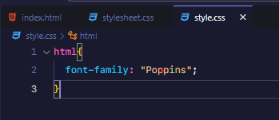

# SETUP FONT
## Bước 1: Tải font cần dùng trên google font hoặc 1 nguồn khác 

Sau đó bấm get font

## Bước 2: bước 2 download font

Bấm download all

## Bước 3: conver font
- Giải nén thư mục đã tải về 

- Sau đó lên google vào web [https://transfonter.org/](https://transfonter.org/) và chọn vào nút add font màu xanh blue

- Và chọn thư mục font đã giải nén chọn tất cả.

- Sau khi đã up xong thì con nút màu xanh lá cây Convert.

- Sau khi convert xong thì bấm nút download để tải về.

- Tải về và giải nén file.

## Bước 4: mở thư mục dự án lên và tạo 1 folder là font

- Sau đó mở lại thư mục convert đã được giải nén ở bước 3 và copy các file font trừ file `demo.html` và file `stylesheet.css `

- Dán vào thư mục font trong dự án 

- Sau đó vào thư mục convert đã giải nén rồi copy file `stylesheet.css` còn lại vào thư mục của dự án

- Sau đó mở file `index.html` lên và import file `stylesheet.css` vào lưu ý đặt trên import file `style.css`

## Bước 5: là bước quan trọng nhất nè.
- Mặc định sẽ là như này:

- Chú í đường dẫn mặc định là `url('Poppins-BlackItalic.woff2')` thì mình phải sửa lại đường dẫn sao cho đúng với cấu trúc thư mục. Do ở đây mình bỏ trong thư mục luôn nên mình dùng đường dẫn tương đối (./fonts), nếu các bạn để ở 1 thư mục ngoài nữa thì sẽ dùng đường dẫn tuyệt đối nhé (ví dụ ../../fonts).

- Các bạn chú ý dòng code thứ 2 ở ảnh trên thì thấy 
**font-family :'Poppins';** thì mình sẽ vào file `style.css` đặt font cho thẻ `HTML` là như vậy luôn

- Xong rồi các bạn qua trình duyệt xem thử nhé. 

- Như ảnh trên là thành công nhé.

