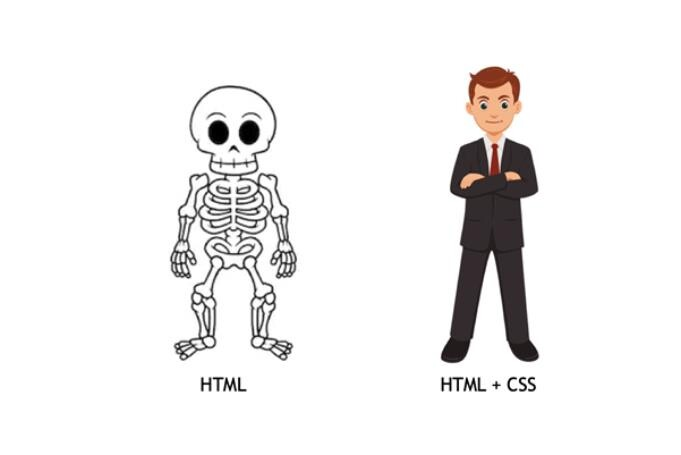
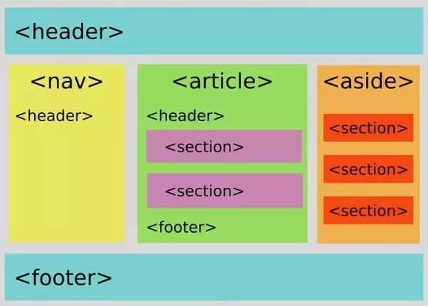

# HTML

## 1. HTML là gì ? 

- **HTML** là viết tắt của **HyperText Markup Language** (Ngôn ngữ đánh dấu siêu văn bản), là một ngôn ngữ đánh dấu được sử dụng để tạo cấu trúc cho các trang web. Nó không phải là một ngôn ngữ lập trình, mà là một ngôn ngữ đánh dấu để mô tả cấu trúc và nội dung của trang web thông qua việc sử dụng các thẻ và thuộc tính. HTML khác văn bản bình thường là khi các bạn xây dựng 1 website thì ngoài việc đọc còn có thể thao tác như là bấm tương tác, play video, âm thanh,...

- **CSS** là viết tắt của **Cascading Style Sheets**, là một ngôn ngữ tạo phong cách và định kiểu cho những yếu tố được viết dưới dạng ngôn ngữ đánh dấu, như là HTML. (Nói rõ hơn buổi sau)

### Tại sao phải học HTML ?

- **Cấu Trúc Trang Web**: HTML giúp xây dựng cấu trúc cơ bản của trang web. Bằng cách sử dụng các thẻ và thuộc tính, bạn có thể định rõ các phần khác nhau của trang web, từ tiêu đề đến nội dung và chia layout.

- **Hiểu Về Web Development**: HTML là một phần quan trọng của phát triển web. Nó là ngôn ngữ cơ bản mà mọi lập trình viên web cần biết để xây dựng và duy trì trang web.

- **Liên Kết Với CSS và JavaScript**: HTML thường kết hợp với CSS (Cascading Style Sheets) để thiết kế giao diện và với JavaScript để thêm tính năng tương tác. Hiểu HTML là bước quan trọng để tiếp tục học các ngôn ngữ và công nghệ khác trong lĩnh vực phát triển web.

- **Tiện Ích Trong Công Việc**: Nếu bạn làm việc trong lĩnh vực liên quan đến trang web, việc hiểu biết về HTML là kiến thức cơ bản và quan trọng. Có thể bạn sẽ cần chỉnh sửa nhanh chóng hoặc hiểu cấu trúc của trang web khi cần thiết.

- **Tạo Nền Tảng Cho Ngôn Ngữ Khác**: Nếu bạn quan tâm đến việc trở thành một lập trình viên web chuyên nghiệp, việc bắt đầu với HTML là quan trọng. Sau đó, bạn có thể mở rộng kiến thức của mình bằng cách học các ngôn ngữ và công nghệ khác như CSS, JavaScript, và các framework web.

Tóm lại, HTML là ngôn ngữ cơ bản và quan trọng trong lĩnh vực phát triển web, là nền tảng để hiểu và xây dựng các trang web hiệu quả.

<div style="text-align: center;">
    
</div>

## 2. Dev tools là gì ?

**DevTools** (còn được gọi là Developer tools) trên trình duyệt web là một bộ công cụ tích hợp giúp các nhà phát triển web kiểm tra, hiệu chỉnh và debug mã nguồn HTML, CSS và JavaScript của trang web. DevTools cung cấp các tính năng mạnh mẽ để giúp nhà phát triển hiểu rõ cấu trúc và hoạt động của trang web, cũng như tối ưu hóa hiệu suất và sửa lỗi.

### Một số tính năng phổ biến của DevTools bao gồm:

- **Elements Panel:** Hiển thị cấu trúc HTML và CSS của trang web. Bạn có thể xem và chỉnh sửa mã nguồn trực tiếp từ đây.

- **Console:** Hiển thị thông báo lỗi, cảnh báo, và bạn có thể nhập và thực thi các đoạn mã JavaScript trực tiếp từ console.

- **Sources Panel:** Cho phép bạn xem và debug mã nguồn JavaScript của trang web.

- **Network Panel:** Hiển thị thông tin về các yêu cầu và phản hồi mà trang web gửi và nhận.

- **Performance Panel:** Đánh giá hiệu suất của trang web, giúp phát hiện và sửa lỗi tối ưu hóa hiệu suất.

- **Application Panel:** Hiển thị thông tin về các tài nguyên như cookies, local storage, và cache.

DevTools là một công cụ quan trọng giúp nhà phát triển xây dựng và duyệt web hiệu quả hơn bằng cách cung cấp các phương tiện để kiểm tra, sửa lỗi, và tối ưu hóa trang web của họ.

## 3. Tạo, đặt tên file trong HTML, cấu trúc của 1 trang web, Comments trong HTML (ghi chú) | cú pháp mở và đóng Comments (vô hiệu hóa code):
`index.html` `about.html` `contact.html` <br>

Lí do đặt là `index.html` làm trang chủ vì sau khi up web lên hosting đa phần các hosting được đặt mặc định là truy cập vào file index.

### Cấu trúc của 1 trang web: 

<div style="text-align: center;">
    
</div>

```html 
<!DOCTYPE html> 
<html lang="en">
<head>
    <meta charset="UTF-8">
    <meta name="viewport" content="width=device-width, initial-scale=1.0">
    <title>Tiêu đề trang</title>
</head>
<body>
    <header></header>
    <main>
      <nav></nav>
      <article></article>
      <aside></aside>
      <h1>Đây là tiêu đề lớn</h1>
      <p>Đây là đoạn văn bản.</p>
    </main>
    <footer></footer>
</body>
</html>
```

### Dưới đây là một giải thích chi tiết về các phần trong mẫu trên:

- `<!DOCTYPE html>`: Khai báo kiểu tài liệu HTML, giúp trình duyệt hiểu được phiên bản HTML nào đang được sử dụng.

- `<html lang="en">`: Phần bao bọc toàn bộ tài liệu HTML và khai báo ngôn ngữ của trang web (ở đây là tiếng Anh).

- `<head>`: Phần này chứa các thông tin meta, tiêu đề trang (`<title>`), và các liên kết tới các tập tin CSS hoặc JavaScript.

- `<meta charset="UTF-8">`: Định rõ bảng mã ký tự sử dụng, thường là UTF-8 để hỗ trợ nhiều ký tự.

- `<meta name="viewport" content="width=device-width, initial-scale=1.0">`: Cấu hình cho trải nghiệm trên các thiết bị di động.

- `<title>`: Đặt tiêu đề của trang web, hiển thị trên thanh tiêu đề của trình duyệt.

- `<body>`: Phần chứa nội dung chính của trang web, bao gồm văn bản, hình ảnh, liên kết, và các phần tử khác.

Các thẻ và nội dung cụ thể sẽ được thêm vào phần `<head>` và `<body>` tùy thuộc vào nhu cầu và yêu cầu cụ thể của trang web bạn đang xây dựng.

## 4. Các thẻ HTML hay gặp cần biết:   

### HTML Headings (Thẻ tiêu đề):
- `<h1>, <h2>,..., <h6>`: thẻ tiêu đề có kích thước giảm dần từ lớn đến nhỏ
- Nên đặt 1 thẻ `<h1>` một trang web nên chỉ có một thẻ h1 duy nhất., Thẻ h1 nên chứa tiêu đề chính của trang và phản ánh nội dung chính.
- thẻ `<h2>` Sử dụng để phân đoạn nội dung trong phần chính của trang. h2 được xem xét như một tiêu đề con của h1.
- thẻ `<h3>` Được sử dụng để chia nhỏ các phần con trong h2.
Cố gắng giữ cho cấp heading không quá sâu.
- thẻ `<h4>, <h5>, <h6>` Sử dụng cho các phần con chi tiết hơn nếu cần thiết. Tránh sử dụng quá nhiều cấp heading nhỏ.

### HTML Layout:
- `<div>...</div>` nhóm và tạo các khu vực hoặc khối trên trang web.
- `<header>...</header>`: đánh dấu phần tiêu đề hoặc phần đầu của một phần tử cha (element).
- `<main>...</main>`: đánh dấu phần nội dung chính của một trang web
- `<footer>...</footer>`: đánh dấu phần chân trang của một phần tử hoặc trang web.
- `<article>...</article>`: đánh dấu ra một phần nội dung độc lập và tự chủ.
- `<nav>...</nav>`: đánh dấu phần chứa các liên kết điều hướng hoặc menu trang web.
- `<section>...</section>`: đánh dấu ra một phần tử chứa một nhóm liên quan các nội dung.
- `<aside>...</aside>`: đánh dấu nội dung phụ trong tài liệu k cần thiết trong trang (quảng cáo).
- `<detail>...</detail> <summary>...</summary> <dialog>...</dialog>`,...
### HTML Text Formating (Định dạng văn bản HTML):
- `<p>...</p>` Trong HTML được sử dụng để định nghĩa đoạn văn bản (paragraph), giữa các đoạn này có một khoảng trắng.
- `<span>...</span>`: Được sử dụng để áp dụng kiểu và thuộc tính cho một phần nhỏ của văn bản.
- `<i>...</i>`: in nghiêng (chỉ là kiểu chữ in nghiêng).
- `<em>...</em>`: im nghiêng (ý nghĩa chính là nổi bật ngữ nghĩa).
- `<b>...</b>`: in đậm.
- `<strong>...</strong>`: quan trọng nhấn mạnh người đọc,
- `<u>...</u>`: gạch dưới.
- `<small>...</small>`: chữ nhỏ.
### HTML Link (Thẻ liên kết):
- `<a>` : Tạo liên kết đến trang web khác hoặc các trang cùng trang web.
### HTML List (Thẻ danh sách):
- `<ul>`: Tạo danh sách không có thứ tự (`<ul>` - unordered list).
- `<ol>`: Tạo danh sách có thứ tự (`<ol>` - ordered list).
- `<li>`: Mỗi mục trong danh sách được đánh dấu bằng thẻ `<li>`.
- `<dl>...</dl> <dt>...</dt> <dd>...</dd>`.

### HTML Frames, Audio, Video & Other:
- `<iframe>...</iframe>`: Nhúng một trang web hoặc nội dung từ một trang web khác vào trang web hiện tại.
- `<autio>...</autio>`: chèn audio.
- `<video>...</video>`: chèn video.
- `<source/>`: được sử dụng chủ yếu trong kết hợp với thẻ <audio> hoặc <video> để xác định nguồn (source) của phương tiện đa phương tiện.
- `<track/>`: Thẻ chứa đoạn văn bản phụ đề. 
- `<embed/>`: được sử dụng để nhúng nội dung bên ngoài, như các đối tượng multimedia (âm thanh, video), ứng dụng Flash, hoặc các ứng dụng khác vào trang web.
- `<object>...</object> <param/>`,...

### HTML Image: 
- ``: Chèn hình ảnh vào trang web.
- `<figure>...</figure>`: được sử dụng để nhóm các nội dung như hình ảnh, biểu đồ, hoặc video cùng với một chú thích (`<figcaption>...</figcaption>`) mô tả nội dung đó.
- `<canvas>...</canvas>`: được sử dụng để vẽ đồ họa, làm các hoạt ảnh, và tạo các đồ họa tương tác trên trang web.
(demo1: [https://futuredev.longdc.info/](https://futuredev.longdc.info/))
(demo2: [https://particle-love.com//](https://futuredev.longdc.info/))
- `<svg>...</svg>`: một ngôn ngữ mô tả đồ họa vector, được sử dụng để mô tả và vẽ các hình vẽ và biểu đồ trên web. 
```html   
<svg width="100" height="100">
  <circle cx="50" cy="50" r="40" stroke="black" stroke-width="3" fill="red" />
</svg>
```
- `<picture>...</picture>`: được sử dụng để cung cấp các biểu thức điều kiện để trình duyệt có thể chọn hình ảnh phù hợp dựa trên kích thước và các yếu tố khác của thiết bị.
- `<map>...</map> <area/>`: 

### HTML Form:
- `<form>...</form>`: HTML form.
- `<input>...</input>`: ô nhập liệu.
- `<label>...</label>`: nhãn cho input (tiêu đề).
- `<button>...</button>`: nút bấm.
- `<textarea>...</textarea>`: ô nhập liệu văn bản.
- `<select>...</select>`: danh sách thả xuống (dropdown list).
- `<option>...</option>`: một lựa chọn trong `<select>...</select>`
- `<optgroup>...</optgroup>`: nhóm các lựa chọn có liên quan `<select>...</select>`.
- `<fieldset>...</fieldset> <legend>...</legend> <datalist>...</datalist> <output>...</output>`

### HTML Tables:
- `<table>...</table>`: Được sử dụng để tạo bảng.
- `<tr>...</tr>`: định nghĩa là một hàng trong bảng. 
- `<th>...</th>`: một ô tiêu đề trong bảng.
- `<td>...</td>`:  một ô dữ liệu (cell) trong bảng.
- `<caption>...</caption>`: ô dữ liệu (data cell) trong bản
- `<thead>...</thead>`: nhóm các dòng (rows) **tiêu đề** trong một bảng. 
- `<tbody>...</tbody>`: nhóm các dòng (rows) **dữ liệu** trong một bảng. 
- `<tfoot>...</tfoot>`: nhóm các dòng (rows) chứa dữ liệu tổng cộng hoặc thông tin tổng kết trong một bảng.
- `<colgroup>...</colgroup>`: nhóm các cột (columns) trong một bảng và cho phép áp dụng các thuộc tính chung cho nhóm đó.
- `<col>...</col>`: để định nghĩa thuộc tính của một hoặc nhiều cột trong một bảng. Thường thì thẻ <col> được sử dụng kết hợp với thẻ <colgroup> để xác định số lượng và chiều rộng của các cột.

## 5. Thẻ tự đóng (Self-closing tags) và thẻ có children:

### Thẻ tự đóng (Self-closing tags):
- Là những thẻ không cần mở và đóng riêng lẻ, mà chúng tự đóng ngay tại một điểm.
- Ví dụ: `, <br>, <input>, <hr>`
``` html 

<br>
<input type="text" placeholder="Enter text">
<hr>
```

### Thẻ có children:
- Là những thẻ mà bạn cần mở và đóng riêng lẻ, và chúng có thể chứa nội dung bên trong.
- Ví dụ: `<div>, <p>, <ul>, <li>, <span>, <h1>,...`
``` html
<div>
  <p>This is a paragraph inside a div.</p>
  <ul>
    <li>Item 1</li>
    <li>Item 2</li>
  </ul>
</div>

<h1>This is a heading</h1>
<p>This is a <span style="color: red;">red</span> word.</p>
<span>This is a span element</span>
```

## 6. Thẻ Block và Inline | so sánh sự khác nhau giữa 2 thẻ:
Trong HTML, thẻ inline và thẻ block là hai loại thẻ mô tả cách mà các phần tử hiển thị trên trang web. Dưới đây là giải thích cơ bản về cả hai loại thẻ:

<div style="text-align: center;">
    
</div>

### Thẻ Block:
- Chiếm toàn bộ chiều rộng của phần container cha.
- Bắt đầu từ một dòng mới và kết thúc ở dòng mới.
- Có thể chứa cả các phần tử khác bên trong, bao gồm cả thẻ block khác và thẻ inline.
- Có thể điều chỉnh chiều rộng, chiều cao, margin, và padding.\
- Một số thẻ block thường dùng là: `<div>, <p>, <h1> -> <h6>, <ul>, <ol>, <li>, <table>, <form>, <header>, <footer>, <section>, <article>, <nav>`. Các thẻ block này giúp tạo ra một bố cục cấu trúc và tổ chức rõ ràng cho trang web của bạn. Sự sử dụng đúng đắn của chúng giúp tăng tính ngữ nghĩa và cải thiện trải nghiệm người dùng.

Ví dụ: 
``` html
<div>
  <p>This is a block element.</p>
  
</div>
```
### Thẻ Inline:
- Chiếm chiều rộng cần thiết để hiển thị nội dung và không tạo ra xuống dòng mới.
- Không thể điều chỉnh chiều rộng và chiều cao, chỉ có thể áp dụng margin và padding.
- Có thể nằm cùng một dòng với các phần tử khác.
- Thường chỉ chứa văn bản và các phần tử inline khác, không chứa được các thẻ block.

Ví dụ:
``` html 
<a>This is an <strong>inline</strong> element.</a>
```

Link kiểm tra thẻ Block và Inline: [https://htmlreference.io/](https://htmlreference.io/)

## 7. Thuộc tính trong HTML là gì ? Và nó có quan trọng không ?
Trong HTML, thuộc tính (attributes) là các thông số được đặt trong các thẻ để cung cấp thêm thông tin về các phần tử. Mỗi thuộc tính đều có một tên và một giá trị, thường được đặt trong cặp tên="giá trị". Ví dụ:

``` html 
<h1 title="Đây là một tiêu đề cấp 1">Đây là một tiêu đề cấp 1</h1>

<a href="https://www.example.com">Đây là một liên kết</a>
<p style="color: blue; font-size: 16px;">Đây là đoạn văn có màu xanh và cỡ chữ 16px</p>
<input type="text" disabled>
<div class="container" id="main-container">Nội dung của div</div>
```

## 8. Quan hệ cha con, cùng khác cấp cần nắm vững:

Trong HTML, quan hệ cha con và cùng khác cấp giữa các phần tử (element) là quan trọng để hiểu, vì nó ảnh hưởng đến cách trình bày và kiểu dáng của trang web.

``` html 
<html>
  <head>
    <title>Trang Web</title>
  </head>
  <body>
    <div>
      <h1>Tiêu đề</h1>
      <p>Đây là một đoạn văn bản.</p>
    </div>
    <ul>
      <li>Mục 1</li>
      <li>Mục 2</li>
    </ul>
  </body>
</html>
```
- Trong ví dụ này, `<html>` là phần tử cấp bậc cao nhất.
- `<head>` và `<body>` là các phần tử con của `<html>`.
- `<div>` chứa `<h1>` và `<p>`, nên `<h1>` và `<p>` là các phần tử con của `<div>` và là cùng cấp với nhau.
- `<ul>` chứa hai` <li>`, nên `<li>` và `<li>` là các phần tử con của `<ul>` và cũng là cùng cấp với nhau.


