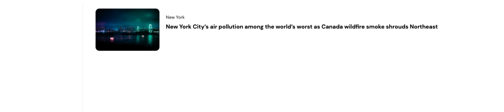
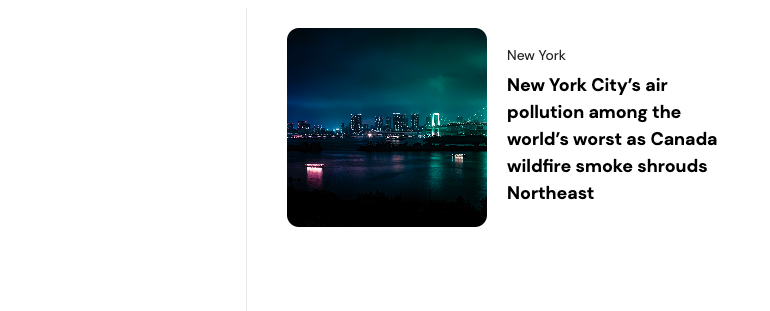
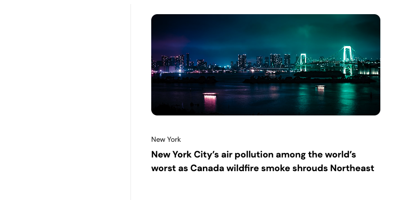
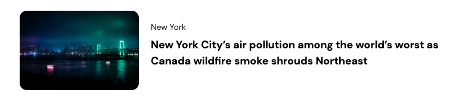
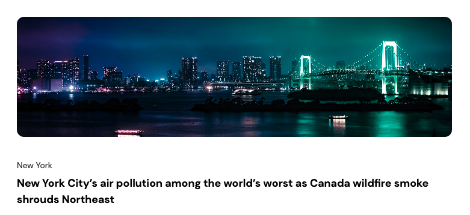

# Responsive (min(), max(), clamp(), Container Query)

## Nội dung bài học:
1. Hàm min(), max(), clamp().
2. Responsive Container query.

## 1. Hàm min(), max(), clamp().

### min:

Trong CSS, min() là một hàm hữu ích để chỉ định giá trị nhỏ nhất giữa các giá trị được cung cấp. Đây là cách sử dụng cơ bản của nó:

``` CSS
.parent{
  width: 1400px;
}
.item {
  width: min(600px, 100%)
}
```

Trong ví dụ này, chiều rộng của phần tử `<div>` sẽ được đặt là giá trị nhỏ nhất giữa 200px và 100% của chiều rộng của phần tử cha (nếu có) như ở vd này là 1440px. Như ở đây giá trị nào nhỏ hơn nó sẽ lấy thằng đó. Đối với đơn vị px thì nó cố định rồi nên rất là dễ hiểu, tuy nhiên đối với đơn vị phần trăm thì chúng ta phải biết 100% đó là phụ thuộc vào ai.

``` html
<div class="parent">
  <div class="item"></div>
</div>
```

Như cấu trúc HTML như thế này thì chắc hẳn các bạn cũng đoán được là 100% là của .parent rồi. Từ đó mình suy ra được **100% = 1400px**. Lúc này code của chúng ta sẽ tường minh hơn như sau **width: min(600px, 1400px)**. Do đó kết quả lúc này của .item sẽ là **600px**. 

>Lưu ý: Mình đang để `.parent` là **1400px**là ví dụ. Đôi khi các bạn để linh động phụ thuộc vào độ rộng của màn hình, thì khi co giãn màn hình tới tầm **500px** đi ha. Thì lúc này nó sẽ lấy là **500px** chứ ko còn là **600px** nữa vì **min(600px, 500px)** 

Bạn có thể sử dụng **min()** để điều chỉnh chiều rộng, chiều cao, padding, margin, và các thuộc tính khác trong CSS.

### max:

Ngược lại với ở hàm min ở trên thì max nó sẽ lấy giá trị lớn hơn thôi. Giải thích cũng tương tự ở trên luôn. Lúc này nó sẽ lấy 1400px vì 1400px > 600px. Khi co màn hình lại tầm 500px thì .item sẽ lấy 600px vì 600px > 500px cho nên cẩn thận xuất hiện scroll ngang làm bể giao diện các bạn nhé.

``` CSS
.parent{
  width: 100%; // base on screen width size
}
.item {
  width: max(600px, 100%)
}
```

Bạn có thể sử dụng **max()** để điều chỉnh chiều rộng, chiều cao, padding, margin, và các thuộc tính khác trong CSS.

### clamp:

Trong CSS, **clamp()** là một hàm mạnh mẽ cho phép bạn giới hạn một giá trị CSS trong một phạm vi nhất định. Cú pháp của **clamp()** là:

``` CSS
clamp(minimum, preferred, maximum);
```

Trong đó:

- minimum là giá trị tối thiểu cho thuộc tính.
- preferred là giá trị mà bạn muốn ưu tiên.
- maximum là giá trị tối đa cho thuộc tính.

Hàm **clamp()** sẽ chọn giá trị ở giữa, nằm giữa giá trị tối thiểu và giá trị tối đa mà không vượt quá giá trị **minimum** và **maximum**.

``` CSS
width: clamp(200px, 50%, 400px);
```

Trong trường hợp này, nếu chiều rộng của phần tử cha lớn hơn 400px, chiều rộng sẽ là 400px. Nếu nhỏ hơn 200px, chiều rộng sẽ là 200px. Nếu nằm giữa 200px và 400px, chiều rộng sẽ được thiết lập là 50% của chiều rộng của phần tử cha.

Hàm clamp() rất hữu ích trong việc tạo ra các thiết kế linh hoạt và đáp ứng trong CSS.

Ví dụ:

``` css
.item{
  width: clamp(100px, 200px, 300px);
  width: max(100px, min(200px, 300px));
}
```

Dòng code đầu tiên là khi mình dùng **clamp(min, val, max)**, và dòng tiếp theo sau đó là cách mà nó hoạt động, nó được viết lại theo 2 hàm mà chúng ta đã tìm hiểu trước đó là **min** và **max**. Nhìn vào thì các bạn cũng đoán được nó sẽ lấy giá trị nào rồi chứ ? Nếu chưa thì để mình phân tích cho.

Đầu tiên nó chạy đoạn **min(200px, 300px)** trước, lúc này chúng ta sẽ được kết quả là **200px**. Tiếp đến sẽ là **max(100px, 200px)** thì nó sẽ là **200px**. Cuối cùng kết quả chúng ta có là **200px**.

Hiểu được cách hoạt động rồi thì tiếp đến là áp dụng nó vào thuộc tính font-size của chữ như thế nào đây ? Và theo yêu cầu của nhiều người đó chính là co giãn theo màn hình nghĩa là logic sẽ chạy theo đơn vị `vw`(viewport width) mấu chốt ở đây.

Mình sẽ có giao diện với chữ `.heading` ở màn hình máy tính có `font-size: 3rem` và ở mobile là `font-size: 1rem` còn ở giữa mình muốn nó linh động co giãn từ 1rem cho tới 3rem.

``` css
.heading{
  font-size: clamp(1rem, Value, 3rem);
}
```

Value ở đây chính là cái quan trọng chúng ta cần tính toán làm sao để nó thuộc giữa 1rem và 3rem.

>Một tool cực kỳ hay cho các bạn đó chính là [https://modern-fluid-typography.vercel.app/](https://modern-fluid-typography.vercel.app/) các bạn chỉ cần điền vào root font-size, giá trị min, giá trị max, fluid size và công cụ này sẽ tính ra được cho các bạn ví dụ như thế này clamp(1rem, 1.5vw + 1rem, 2rem)

Dù có công cụ làm giùm hay chúng ta tự làm đi chăng nữa thì các bạn cũng phải test lại cho chính xác như yêu cầu nhé. Các bạn có thể [nhấn vào đây](https://codesandbox.io/s/css-clamp-y2lell?file=/index.html) để xem demo code nha.

``` css
font-size: clamp(1rem, 0.7rem + 1.5vw, 2rem);
```

## 2. Responsive container query

Đối với Frontend Developer thì việc tối ưu giao diện **Responsive** là điều hiển nhiên rồi. Và thông thường từ trước đến giờ là dùng **Media Queries** để làm việc đó. Ngoài **MQ(Media Queries)** ra thì còn có **Container Queries**.

Đầu tiên chúng ta phải hiểu rằng khi sử dụng **MQ(Media queries)** thì chúng ta sẽ dựa vào **Viewport** của màn hình sẽ có các **breakpoints** như **1024**, **1280**, **768…**. Tuy nhiên khi sử dụng **CQ(Container Queries)** thì sẽ dựa vào độ rộng của **Container**. **Container** thường chính là thằng cha chứa item mình muốn **responsive**, hoặc 1 thằng bao bên ngoài thằng cha chứa nó nữa tùy theo logic.



Giao diện ở trên là **Sidebar** ở phía bên trái, còn bên phải là **Main**, trong Main chứa **Card** với cấu trúc HTML và CSS như sau:

``` html 
<div class="wrapper">
  <div class="sidebar"></div>
  <div class="main">
    <div class="card">
      <div class="card-image">
        
      </div>
      <div class="card-content">
        <p class="card-city">New York</p>
        <h3 class="card-title">
          New York City’s air pollution among the world’s worst as Canada wildfire smoke shrouds Northeast
        </h3>
      </div>
    </div>
  </div>
</div>

```

``` CSS
.wrapper {
  display: grid;
  grid-template-columns: 250px minmax(0, 1fr);
  grid-gap: 20px;
  height: 100vh;
}
.sidebar {
  border-right: 1px solid #eee;
}
.main {
  padding: 20px;
}
.card {
  display: flex;
  gap: 20px;
}
.card-image {
  overflow: hidden;
  width: 100%;
  flex: 0 0 200px;
}
.card-image img {
  border-radius: 12px;
  width: 100%;
  height: 100%;
  object-fit: cover;
}
.card-content {
  padding: 20px 0;
  flex: 1;
}
.card-city {
  font-size: 14px;
  margin-bottom: 10px;
  color: #333;
}
.card-title {
  font-size: 18px;
  font-weight: bold;
  line-height: 1.5;
}
```

Khi ở màn hình tầm **< 900px** thì giao diện sẽ hiển thị như sau



Các bạn sẽ thấy một vấn đề là `.card` giao diện hiển thị như vầy nó không ổn một chút nào cả. Vì có thể kết quả mà chúng ta muốn là như dưới đây. Nếu vậy thì có thể chúng ta sẽ dùng **MQ** cho màn hình **< 900px** thay đổi `flex-direction: column` là xong xuôi.

``` CSS
/* Media queries */
@media screen and (max-width: 900px) {
  .card {
    flex-direction: column;
  }
}
```


Tuy nhiên chúng ta sẽ gặp một vấn đề nữa là khi màn hình **< 800px** thì **Sidebar** đã bị ẩn cho nên thằng **Main** sẽ tràn ra chiếm hết diện tích và lúc này thằng `.card` nó bị như dưới thì lại xấu quá, đáng lẽ nó nên nằm ngang như ở màn hình máy tính thì có lẽ sẽ đẹp hơn.

``` CSS
/* Media queries */
@media screen and (max-width: 800px) {
  .sidebar {
    display: none;
  }
  .wrapper {
    display: block;
  }
  .card {
    flex-direction: row;
  }
}
```



Để giải quyết nó thì chúng ta lại phải code thêm MQ cho một màn hình **< 800px** cho nó `flex-direction: row` lại, rồi khi màn hình **< 480px** thì lại thiết lập `flex-direction: column` lại nữa.

``` CSS
@media screen and (max-width: 480px) {
  .card {
    flex-direction: column;
  }
}
```



Dùng **MQ** phức tạp quá, nhưng không sao, **Container Queries** đến để giải cứu vấn đề này. Để sử dụng **CQ**, thì chúng ta sẽ code vào phần tử bao ngoài chứa phần tử bên trong mà chúng ta muốn xử lý giao diện. Đối với cấu trúc HTML ở trên thì thằng chúng ta muốn xử lý giao diện là `.card`, và phần tử bao ngoài của nó(trong trường hợp này) là `.main`

>Lưu ý: Phần tử sử dụng Container Queries không nhất thiết phải là thằng gần nhất, tùy thuộc vào logic của giao diện.

``` CSS
/* container queries */
.main {
  container-name: card;
  container-type: inline-size;
}
@container card (max-width: 500px) {
  .card {
    flex-direction: column;
  }
}
```

Như các bạn thấy đoạn code ở trên thì để sử dụng **CQ**, ở class `.main` mình sử dụng đoạn `container-name: card` và `container-type: inline-size`. Container name là không bắt buộc, tuy nhiên mình khuyến khích các bạn đặt tên cho dễ nhận biết nhé

Để sử dụng thì các bạn viết như này, nhớ thay **ContainerName** thành tên nào tùy vào logic của các bạn nha.

``` CSS
.some-class{
  container-name: ContainerName;
  container-type: inline-size;
}
@container ContainerName (min or max width, height){
  // code
}
```

Các bạn có thể xem trực tiếp kết quả của ví dụ từ nãy đến giờ dưới này hoặc [nhấn vào đây](https://codesandbox.io/s/qlhghl) để xem toàn trang nhé.

>Lưu ý: Phần tử sử dụng Container Queries thì không áp dụng @container vào chính nó được, mà chỉ áp dụng vào phần tử con của nó như mình đã làm ví dụ ở trên. Một ví dụ sai ở dưới đây cho các bạn biết mà tránh.

``` CSS
.main {
  container-name: card;
  container-type: inline-size;
}
@container card (max-width: 500px) {
  .main {
    flex-direction: column;
  }
}
```

Hi vọng thông qua kiến thức mới này sẽ giúp các bạn sẽ có thêm cách về việc xử lý giao diện Responsive một cách xịn xò hơn. Ngoài ra các bạn có thể [nhấn vào đây](https://lab.ishadeed.com/container-queries) để tham khảo thêm nhiều giao diện có sử dụng Container Queries cực xịn xò của tác giả [IShadeed](https://ishadeed.com/articles/).


