# Table, Form, Custom input.

### Nội dung bài học
### I. Table
1. Table Borders.
2. HTML Table Sizes.
3. HTML Table Headers.
4. HTML Table Padding & Spacing.
5. HTML Table Colspan & Rowspan.
6. HTML Table Styling.
7. HTML Table Colgroup.
### II. Form
1. input.
2. label.
3. Select.
4. textarea.
5. button.
6. datalist.

### III. Các thuộc tính(Attributes) trong input:

## I. Table
Trong CSS, bạn có thể sử dụng các thuộc tính và lựa chọn để tạo ra bảng.

Một cấu trúc chuẩn của một bảng HTML thường bao gồm các phần sau:

- **`<table>`**: Đây là phần tổng thể của bảng.

- **`<thead>`**(Tiêu đề của bảng): Thường chứa các hàng (**`<tr>`**) của tiêu đề của bảng.

- **`<tbody>`** (Thân của bảng): Chứa các hàng (**`<tr>`**) của nội dung của bảng.

- **`<tfoot>`** (Chân của bảng - tùy chọn): Thường chứa các hàng (**`<tr>`**) của bảng được sử dụng để hiển thị các tổng hoặc các thông tin khác dưới cùng của bảng.

- **`<tr>`** (Hàng của bảng): Đại diện cho mỗi hàng trong bảng.

- **`<th>`** (Ô tiêu đề): Được sử dụng để đặt tiêu đề cho mỗi cột hoặc hàng. Thông thường được sử dụng trong phần **`<thead>`**.

- **`<td>`** (Ô dữ liệu): Được sử dụng để chứa dữ liệu cho mỗi ô trong bảng. Thường được sử dụng trong phần **`<tbody>`** và **`<tfoot>`**.

- **`<caption>`**: Được sử dụng để thêm mô tả hoặc tiêu đề cho bảng.

- **`<colgroup>`**: Được sử dụng để nhóm các cột trong bảng và áp dụng các thuộc tính cho chúng.

- **`<col>`**: Được sử dụng để xác định các thuộc tính cho từng cột.

- **`<col span="1">`**: Định nghĩa một cột và thuộc tính của nó, trong trường hợp này, chỉ một cột.

- **`<col span="2">`**: Định nghĩa hai cột và thuộc tính của chúng.

Dưới đây là một ví dụ minh họa về cấu trúc chuẩn của một bảng HTML:

``` HTML
<table>
  <!-- Phần mô tả của bảng -->
  <caption>Thông tin bảng</caption>

  <!-- Phần quản lý cột -->
  <colgroup>
    <col span="1" style="background-color:red">
    <col span="2" style="background-color:yellow">
  </colgroup>

  <!-- Tiêu đề của bảng -->
  <thead>
    <tr>
      <th>Column 1</th>
      <th>Column 2</th>
      <th>Column 3</th>
    </tr>
  </thead>

  <!-- Thân của bảng -->
  <tbody>
    <tr>
      <td>Data 1</td>
      <td>Data 2</td>
      <td>Data 3</td>
    </tr>
    <!-- Các hàng khác -->
  </tbody>

  <!-- Chân của bảng -->
  <tfoot>
    <tr>
      <td colspan="3">Tổng cộng: 3 hàng</td>
    </tr>
  </tfoot>
</table>

```

``` CSS
table, th, td {
  border: 1px solid black;
}
```

### 1. Table Borders
Các bảng HTML có thể có các đường viền có kiểu dáng và hình dạng khác nhau.

**a. Table Borders:**

``` CSS
table, th, td {
  border: 1px solid black;
}
```
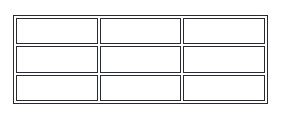

**b. Collapsed Table Borders:**

Để tránh có đường viền kép như trong ví dụ trên, hãy đặt thuộc tính CSS border-collapse thành thu gọn. Điều này sẽ làm cho các đường viền thu gọn lại thành một đường viền duy nhất:

```CSS
table, th, td {
  border: 1px solid black;
  border-collapse: collapse;
}
```

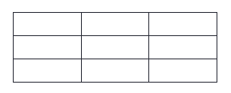

**c. Style Table Borders**

``` CSS
table, th, td {
  border: 1px solid white;
  border-collapse: collapse;
}
th, td {
  background-color: #96D4D4;
}
```

Nếu bạn đặt màu nền cho mỗi ô và đặt đường viền màu trắng (giống như nền tài liệu), bạn sẽ có ấn tượng về một đường viền vô hình:

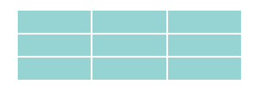

**d. Round Table Borders**

Với thuộc tính **`border-radius`**, các đường viền có các góc tròn:

```CSS
table, th, td {
  border: 1px solid black;
  border-radius: 10px;
}
```

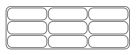

**e. Dotted Table Borders**

Với thuộc tính border-style, bạn có thể thiết lập hình thức của đường viền.

``` CSS
 th, td {
  border-style: dotted;
}
```

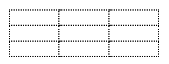

Ngoài ra còn thêm 1 số thuộc tính khác:

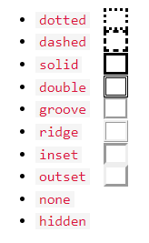

### 2. HTML Table Sizes:

Các bảng HTML có thể có kích thước khác nhau cho từng cột, hàng hoặc toàn bộ bảng.

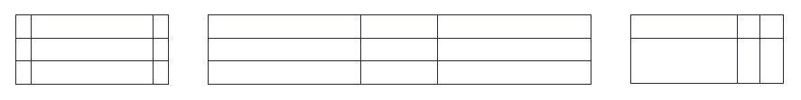

**a. HTML Table Width:**

Để đặt độ rộng của bảng, hãy thêm thuộc tính style vào phần tử `<table>`

``` HTML
<table style="width:100%">
  <tr>
    <th>Firstname</th>
    <th>Lastname</th>
    <th>Age</th>
  </tr>
  <tr>
    <td>Jill</td>
    <td>Smith</td>
    <td>50</td>
  </tr>
  <tr>
    <td>Eve</td>
    <td>Jackson</td>
    <td>94</td>
  </tr>
</table>
```

Như ví dụ trên thì bảng sẽ chiếm 100% width theo element chứa nó.

**b. HTML Table Column Width or Height**

Để đặt kích thước của một cột cụ thể, hãy thêm thuộc tính style trên phần tử `<th>` hoặc `<td>`.

``` html
<table style="width:100%">
  <tr>
    <th style="width:70%">Firstname</th>
    <th>Lastname</th>
    <th>Age</th>
  </tr>
  <tr style="height: 200px">
    <td>Jill</td>
    <td>Smith</td>
    <td>50</td>
  </tr>
  <tr>
    <td>Eve</td>
    <td>Jackson</td>
    <td>94</td>
  </tr>
</table>
```

Như ví dụ trên thì cột đầu tiên sẽ chiếm 70% width so với table và chiều cao của dòng thứ 2 cao 200px

### 3. HTML Table Headers:

Tiêu đề bảng được xác định bằng phần tử th. Mỗi phần tử thứ đại diện cho một ô của bảng.

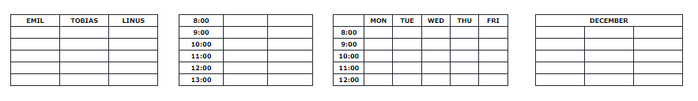

Ví dụ:

```html
<table>
  <tr>
    <th>Firstname</th>
    <th>Lastname</th>
    <th>Age</th>
  </tr>
  <tr>
    <td>Jill</td>
    <td>Smith</td>
    <td>50</td>
  </tr>
  <tr>
    <td>Eve</td>
    <td>Jackson</td>
    <td>94</td>
  </tr>
</table>
```
**a. Vertical Table Headers**

``` html
<table>
  <tr>
    <th>Firstname</th> 
    <td>Jill</td>
    <td>Eve</td>
  </tr>
  <tr>
    <th>Lastname</th>
    <td>Smith</td>
    <td>Jackson</td>
  </tr>
  <tr>
    <th>Age</th>
    <td>94</td>
    <td>50</td>
  </tr>
</table>
```
**b. Align Table Headers**

Theo mặc định, tiêu đề bảng được in đậm và căn giữa:

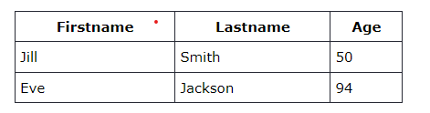

Để căn trái các tiêu đề bảng, hãy sử dụng thuộc tính CSS text-align:

``` CSS
th {
  text-align: left;
}
th,td{
  /* căn dọc theo trục Y */
  vertical-align: middle; 
}
```
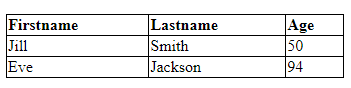

**c.Header for Multiple Columns**

Có thể có tiêu đề trải dài trên hai hoặc nhiều cột.

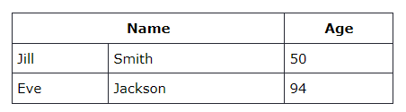

Để thực hiện việc này, hãy sử dụng thuộc tính `colspan` trên phần tử `<th>`:

``` html
<table>
  <tr>
    <th colspan="2">Name</th>
    <th>Age</th>
  </tr>
  <tr>
    <td>Jill</td>
    <td>Smith</td>
    <td>50</td>
  </tr>
  <tr>
    <td>Eve</td>
    <td>Jackson</td>
    <td>94</td>
  </tr>
</table>
```

**d. Table Caption**

Bạn có thể thêm chú thích làm tiêu đề cho toàn bộ bảng.

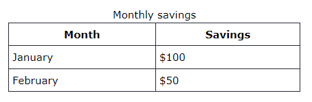

Để thêm chú thích vào bảng, hãy sử dụng thẻ `<caption>`:

``` html
<table style="width:100%">
  <caption>Monthly savings</caption>
  <tr>
    <th>Month</th>
    <th>Savings</th>
  </tr>
  <tr>
    <td>January</td>
    <td>$100</td>
  </tr>
  <tr>
    <td>February</td>
    <td>$50</td>
  </tr>
</table>
```

>Lưu ý: Thẻ `<caption>` phải được chèn ngay sau thẻ `<table>`.

### 4.HTML Table Padding & Spacing:

Các bảng HTML có thể điều chỉnh phần đệm bên trong các ô cũng như khoảng cách giữa các ô.

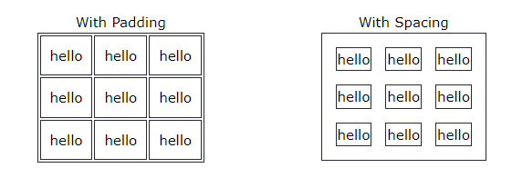

**a. HTML Table - Cell Padding**

- `padding` ô là khoảng cách giữa các cạnh ô và nội dung ô. 
- Theo mặc định, `padding` được đặt thành 0. 
- Để thêm `padding` vào các ô của bảng, hãy sử dụng thuộc tính phần đệm CSS:

``` CSS
th, td {
  padding: 15px;
}
```

**b. HTML Table - Cell Spacing**

Ngoài sử dụng padding thì chúng ta có thể sử dụng thuộc tính hổ trợ để tạo khoảng cách giữa các ô

- `Cell Spacing` là khoảng cách giữa mỗi ô. 
- Theo mặc định, không gian được đặt thành `2 pixel`. 
- Để thay đổi khoảng cách giữa các ô trong bảng, hãy sử dụng thuộc tính CSS `border-spacing` trên thành phần bảng:

```CSS
table {
  border-spacing: 30px;
}
```

### 5. HTML Table Colspan & Rowspan:

Các bảng HTML có thể có các ô trải rộng trên nhiều hàng và/hoặc cột.

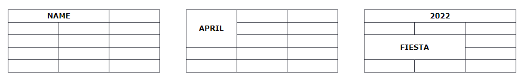

```html
<table style="width:100%">
  <tr>
    <th colspan="2">Name</th>
    <th>Age</th>
  </tr>
  <tr>
    <td>Jill</td>
    <td>Smith</td>
    <td>43</td>
  </tr>
  <tr>
    <td>Eve</td>
    <td>Jackson</td>
    <td>57</td>
  </tr>
</table>
```

### 6. HTML Table Styling:

Sử dụng CSS để làm cho bảng trông đẹp hơn.

``` CSS
tr:nth-child(even) {
  background-color: #D6EEEE;
}
```

### 7. HTML Table Colgroup:

Phần tử <colgroup> được sử dụng để tạo kiểu cho các cột cụ thể của bảng.

Tham khảo [https://www.w3schools.com/html/html_table_colgroup.asp](https://www.w3schools.com/html/html_table_colgroup.asp)

## II. Form

Một biểu mẫu HTML được sử dụng để thu thập thông tin đầu vào của người dùng. Đầu vào của người dùng thường được gửi đến máy chủ để xử lý.

Ví dụ:

``` html
<form>
  <label for="name">Name:</label>
  <input type="text" id="name" name="name">
  
  <label for="email">Email:</label>
  <input type="email" id="email" name="email">
  
  <input type="submit" value="Submit">
</form>
```

Phần tử HTML **`<form>`** có thể chứa một hoặc nhiều phần tử biểu mẫu sau:
- **`<input>`**
- **`<label>`**
- **`<select>`**
- **`<textarea>`**
- **`<button>`**
- **`<fieldset>`**
- **`<legend>`**
- **`<datalist>`**
- **`<output>`**
- **`<option>`**
- **`<optgroup>`**

### a. input
- Một trong những phần tử biểu mẫu được sử dụng nhiều nhất là phần tử **`<input>`**.

- Phần tử **`<input>`** có thể được hiển thị theo nhiều cách, tùy thuộc vào thuộc tính type

``` html
<input type="button">
<input type="checkbox">
<input type="color">
<input type="date">
<input type="datetime-local">
<input type="email">
<input type="file">
<input type="hidden">
<input type="image">
<input type="month">
<input type="number">
<input type="password">
<input type="radio">
<input type="range">
<input type="reset">
<input type="search">
<input type="submit">
<input type="tel">
<input type="text">
<input type="time">
<input type="url">
<input type="week">
```


### b. Label

- Phần tử **`<label>`** xác định nhãn cho một số phần tử biểu mẫu. 
- Phần tử **`<label>`** rất hữu ích cho người dùng trình đọc màn hình vì trình đọc màn hình sẽ đọc to nhãn khi người dùng tập trung vào phần tử đầu vào. 
- Phần tử **`<label>`** cũng giúp người dùng gặp khó khăn khi nhấp vào các vùng rất nhỏ (chẳng hạn như nút radio hoặc hộp kiểm) - bởi vì khi người dùng nhấp vào văn bản trong phần tử **`<label>`**, nó sẽ chuyển đổi nút radio/hộp kiểm. 
- Thuộc tính for của thẻ **`<label>`** phải bằng thuộc tính id của phần tử **`<input>`** để liên kết chúng lại với nhau.

Ví dụ: *First name* chính là label

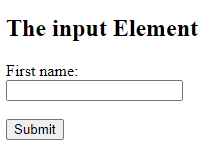

### c. Select

Tạo 1 danh sách có sẳn để người dùng chọn.

``` html
<form action="/action_page.php">
  <label for="cars">Choose a car:</label>
  <select id="cars" name="cars">
    <option value="volvo">Volvo</option>
    <option value="saab">Saab</option>
    <option value="fiat" selected>Fiat</option>
    <option value="audi">Audi</option>
  </select>
  <input type="submit">
</form>
```

Ngoài ra còn có thêm attribute của select
- `size="4"`: là hiển thị 4 item trong selector đó.
- `multiple`: là cho phép người dùng chọn nhiều option.

`Option` cũng có attribute là: `selected` dùng để chỉ định giá trị mặc địch được chọn sẳn.

### d. textarea:

Phần tử `<textarea>` xác định trường nhập nhiều dòng (vùng văn bản):

``` html
<textarea name="message" rows="10" cols="30">
The cat was playing in the garden.
</textarea>
```

Trong đó:
- Thuộc tính `row` chỉ định số dòng hiển thị trong vùng văn bản. 
- Thuộc tính `cols` chỉ định chiều rộng hiển thị của vùng văn bản.

Ngoài ra còn có thể dùng css để điều chỉnh kích thước:

``` html
<textarea name="message" style="width:200px; height:600px;">
The cat was playing in the garden.
</textarea>
```

>Lưu ý thên: có thể k cho resize textarea bằng cách thêm thuộc tính trong css `resize: none;`

### g. button:

Dùng để tạo nút có thể bấm được.

``` html
<button type="button" onclick="alert('Hello World!')">Click Me!</button>
```

### h. fieldset và legend:

- Phần tử `<fieldset>` được sử dụng để nhóm dữ liệu liên quan trong một biểu mẫu. 
- Phần tử `<legend>` xác định chú thích cho phần tử `<fieldset>`.

``` html
<form action="/action_page.php">
  <fieldset>
    <legend>Personalia:</legend>
    <label for="fname">First name:</label><br>
    <input type="text" id="fname" name="fname" value="John"><br>
    <label for="lname">Last name:</label><br>
    <input type="text" id="lname" name="lname" value="Doe"><br><br>
    <input type="submit" value="Submit">
  </fieldset>
</form>
```

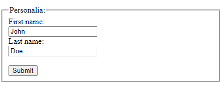

### i. datalist:

- Phần tử `<datalist>` chỉ định danh sách các tùy chọn được xác định trước cho phần tử `<input>`. 
- Người dùng sẽ thấy danh sách thả xuống gồm các tùy chọn được xác định trước khi họ nhập dữ liệu. 
- Thuộc tính list của phần tử `<input>` phải tham chiếu đến thuộc tính id của phần tử `<datalist>`.

``` html
<form action="/action_page.php">
  <input list="browsers" name="browser">
  <datalist id="browsers">
    <option value="Edge">
    <option value="Firefox">
    <option value="Chrome">
    <option value="Opera">
    <option value="Safari">
  </datalist>
  <input type="submit">
</form>
```

## III. Các thuộc tính(Attributes) trong input: 

Trong HTML, các thuộc tính (attributes) cho phần tử `<input>` cho phép bạn tùy chỉnh các khía cạnh khác nhau của một trường nhập liệu. Dưới đây là một số thuộc tính phổ biến của phần tử `<input>`:

- `type`: Xác định kiểu dữ liệu được chấp nhận trong trường nhập liệu.
- `name`: Xác định tên của trường nhập liệu, sẽ được gửi đi cùng với dữ liệu khi mẫu được gửi đi.
- `id`: Xác định một ID duy nhất cho trường nhập liệu, hữu ích để liên kết với các nhãn (labels) hoặc để thao tác với JavaScript.
- `value`: Xác định giá trị mặc định cho trường nhập liệu.
- `placeholder`: Xác định một văn bản ngắn xuất hiện trong trường nhập liệu khi không có giá trị.
disa`b`led: Nếu được đặt, trường nhập liệu sẽ không thể sửa đổi hoặc gửi dữ liệu.
- `required`: Nếu được đặt, yêu cầu người dùng phải điền vào trường này trước khi gửi mẫu.
- `readonly`: Nếu được đặt, trường nhập liệu chỉ có thể đọc và không thể sửa đổi.
- `maxlength`: Xác định số ký tự tối đa được phép trong trường nhập liệu.
- `min` và `max`: Xác định giá trị tối thiểu và tối đa được chấp nhận trong trường số.
- `pattern`: Xác định một biểu thức chính quy (regular expression) mà giá trị của trường nhập liệu phải 

Ví dụ:

``` html
<input type="text" name="username" id="username" placeholder="Enter your username" required>

<input type="password" name="password" id="password" placeholder="Enter your password" required>

<input type="email" name="email" id="email" placeholder="Enter your email" required>

<input type="number" name="age" id="age" min="18" max="100" placeholder="Enter your age" required>

```