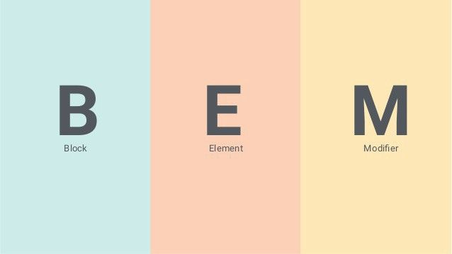
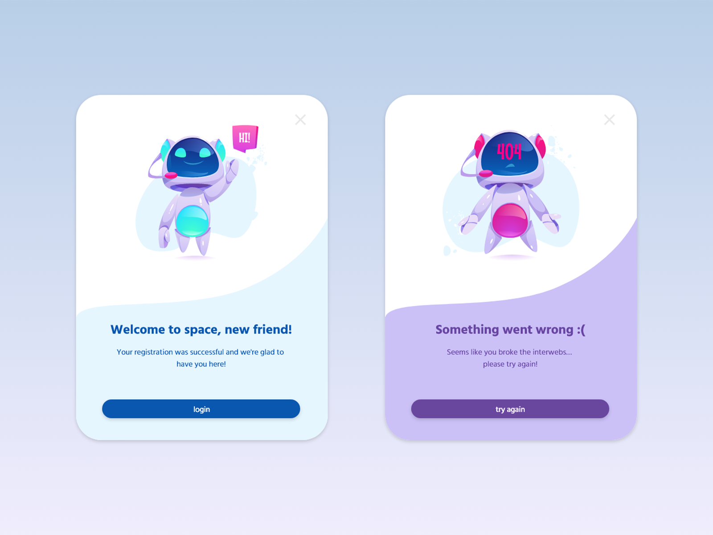
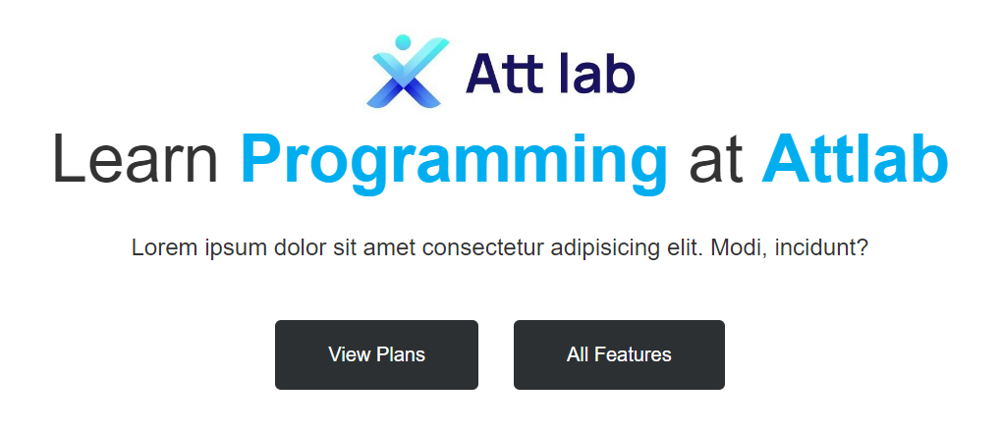
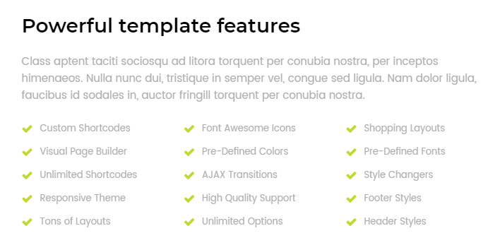
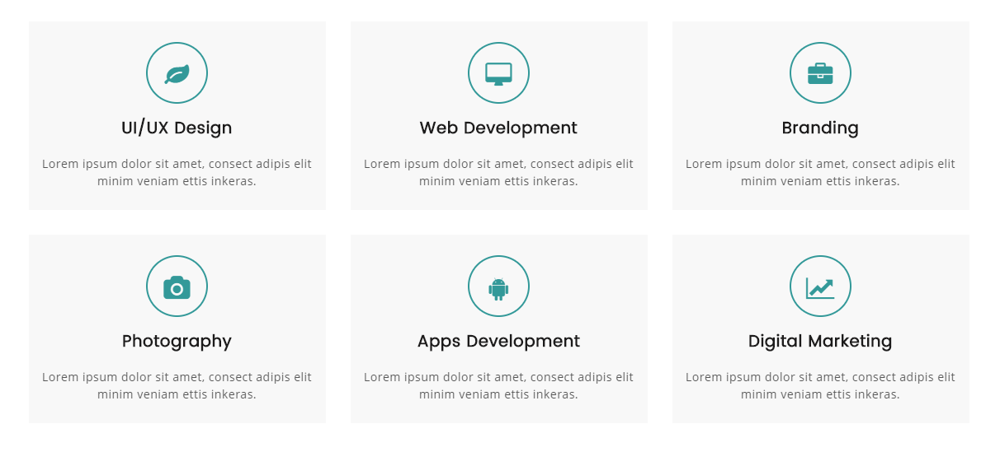
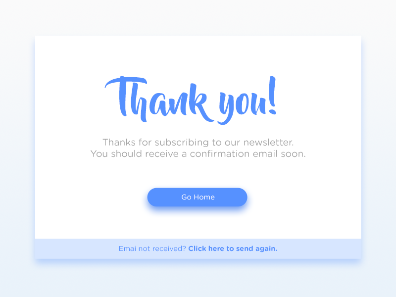
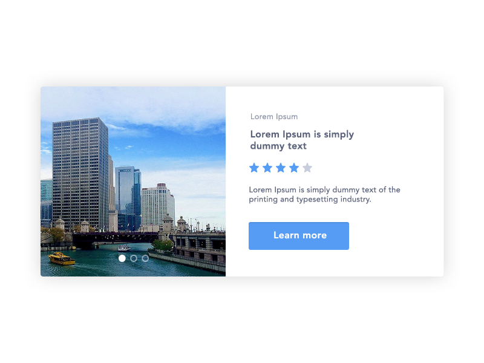
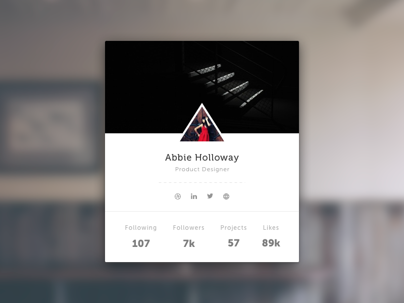

# HTML
## Nội dung buổi 2:
1. Nắm vững kỹ thuật gom nhóm, phân tích giao diện.
2. Sự khác biệt giữa thuộc tính class và id.
3. Vấn đề đặt tên class trong HTML.
4. BEM là gì? Quy ước đặt tên dành cho CSS.
5. Ví dụ thực tế với BEM.
6. Các kiểu đặt tên khác.
7. Code HTML nhanh với Emmet trong VSCode cần biết.
8. Bài tập thực hành.
## 1. Nắm vững kỹ thuật gom nhóm, phân tích giao diện.
<div style="text-align: center;">
    
</div>

## 2. Sự khác biệt giữa thuộc tính class và id:

Trong HTML và CSS, **`class`** và **`id`** là hai thuộc tính quan trọng `giúp xác định` và `định dạng các phần tử trên trang web`.
### Class:
- Mục đích chính: Được sử dụng để nhóm các phần tử có cùng kiểu hoặc đặc tính và áp dụng các quy tắc CSS chung cho chúng.
- Cú pháp: 
``` html 
<tag class="tên-class">...</tag>
```
- Ví dụ: 
``` html 
<div class="container">...</div>
<p class="title">...</p>
```
- Lưu ý: Một phần tử có thể có nhiều class, chúng cách nhau bằng dấu khoảng trắng.
``` html
<div class="container container-top">...</div>
```
### ID:
- Mục đích chính: Dùng để xác định duy nhất một phần tử trên trang web, giúp chọn đến phần tử cụ thể đó trong CSS hoặc JavaScript.
- Cú pháp: 
``` html
<tag id="tên-id">...</tag>
```
- Ví dụ: 
``` html
<p id="paragraph1">Nội dung đoạn văn</p>
```
- Lưu ý: Mỗi id trên trang web phải là duy nhất. Không thể có hai phần tử cùng một id.
``` html
<p id="paragraph1">Nội dung đoạn văn 1</p>
<p id="paragraph1">Nội dung đoạn văn 2</p> -> sai
```

## 3. Vấn đề đặt tên class trong HTML

Quy tắc đặt tên class trong HTML là quan trọng để làm cho mã nguồn dễ đọc, dễ bảo trì và dễ hiểu. Dưới đây là một số nguyên tắc và gợi ý khi đặt tên class:
#### Mô tả rõ ràng:
- Đặt tên sao cho nó phản ánh đúng mục đích hoặc chức năng của phần tử đó.
- Ví dụ, **`.btn-primary`** cho nút chính hoặc **`.section-heading`** cho tiêu đề của một phần.
- Tránh những tên không rõ ràng hoặc quá ngắn gọn.
#### Sử dụng từ ngữ đúng:
- Sử dụng từ ngữ mà mọi người có thể hiểu được và đồng thuận (tiếng anh).
- Tránh sử dụng các từ ngữ viết tắt hoặc quá trừu tượng.
#### Không bắt đầu bằng số:
- Tên class không nên bắt đầu bằng một con số. Điều này không hợp lý và có thể tạo ra những vấn đề khi chọn phần tử trong CSS hoặc JavaScript.
#### Sử dụng dấu gạch ngang (-), dấu gạch dưới (_) hoặc camelCase:
- Sử dụng dấu gạch ngang hoặc dấu gạch dưới để tách các từ trong tên class.
- Ví dụ: header-container, main_content, hoặc headerContainer, mainContent.
#### Ngữ cảnh:
- Nếu có nhiều class trong cùng một dự án, hãy thêm một tiền tố để ngăn chúng xung đột.
- Ví dụ: blog-post-title, blog-post-content, thay vì title hoặc content.
#### Không sử dụng các từ khóa có ý nghĩa đặc biệt:
- Tránh sử dụng các từ khóa có ý nghĩa đặc biệt như class, id, style làm tên class.

## 4. BEM là gì? Quy ước đặt tên dành cho CSS
BEM là viết tắt của Block, Element, Modifier, một phương pháp trong việc đặt tên class trong lập trình front-end và thiết kế web. Được tạo ra bởi Yandex, mô hình này giúp tổ chức và quản lý mã nguồn CSS một cách rõ ràng và dễ bảo trì.

Việc đặt tên theo chuẩn giúp các lập trình viên frontend hiểu được đoạn code đó có ý nghĩa gì, nó thực hiện nhiệm vụ gì. Từ đó những lập trình viên khác khi đọc vào code của bạn họ cũng hiểu được bạn đang làm gì, từ đó dễ dàng phân tích, thay đổi và quản lý hơn sau này.

### Tại sao nên sử dụng BEM?
Trong những dự án nhỏ có thể BEM chưa cần sử dụng nhưng trong các dự án lớn và làm việc với nhóm thì BEM rất quan trọng.

<div style="text-align: center;">
    
</div>

### Những thành phần cơ bản của BEM

#### Block (B) | **Block**  : 
- Là một phần tử độc lập, tồn tại mà không phụ thuộc vào bất kỳ phần tử nào khác.
- Được đặt tên chung và mô tả chức năng hoặc ý nghĩa của phần tử.
``` html
<div class="laptop"></div>
```
#### Element (E) | **block__element**:
- **Element:** là một phần của Block mà không có ý nghĩa khi độc lập. 
- **Element** luôn là một phần của block và được phân biệt bằng dấu hai gạch dưới (`__`).
```html
<div class="laptop">
    <div class="laptop__keyboard"></div>
    <div class="laptop__touchpad"></div>
    <div class="laptop__screen"></div>
</div>
```
#### Modifier (M) | **block--modifier** | **block__element--modifier**:
- Là một biến thay đổi trạng thái hoặc ngoại hình của Block hoặc Element.
- **Modifier: được phân biệt bằng dấu hai gạch nối (`--`). Ví dụ: `menu--hidden`, `list__item--active`.
``` html
<div class="laptop laptop--small">
  <div class="laptop__keyboard laptop__keyboard--green"></div>
  <div class="laptop__keyboard laptop__keyboard--yellow"></div>
</div>
```
#### Tùy theo mỗi công ty thì có 1 nguyên tắc tuân theo

## 5. Ví dụ thực tế với BEM
<div style="text-align: center;">
    
</div>

``` html
<div class="card">
    
    <p class="card__title card__title--bold">Wellcome to space, new friend!</p>
    <p class="card__description ">You register ...</p>
    <button class="card__button">Login</button>
</div>
```

## 6. Các kiểu đặt tên khác

### Semantic Naming:

Sử dụng tên class có ý nghĩa và miêu tả chức năng của phần tử.
```html
<div class="header">
  <span class="logo">My Website</span>
</div>
```
### Functional Naming:

Đặt tên class dựa trên chức năng của phần tử.
```html
<button class="btn-primary">Submit</button>
```
### Atomic Naming:

Sử dụng class rất nhỏ và tái sử dụng chúng để xây dựng giao diện.
```html
<div class="m-0 p-10 text-center">Content</div>
```
### Component-based Naming:

Gán tên class dựa trên các thành phần cụ thể của giao diện.
```html
<div class="product-card">
  
  <h3 class="product-title">Product Name</h3>
</div>
```
### Utility-first Naming (Tailwind CSS style):

Sử dụng class ngắn gọn và có ý nghĩa trực tiếp, thường dựa trên các tính năng cụ thể của CSS.
```html
<div class="bg-blue-500 text-white p-4">Content</div>
```
### ID Naming:

Sử dụng ID để xác định phần tử duy nhất.
```html
<div id="header"></div>
```
Mỗi phong cách đặt tên class đều có ưu điểm và nhược điểm của nó. Lựa chọn phụ thuộc vào yêu cầu cụ thể của dự án, sở thích của đội ngũ phát triển và môi trường làm việc. Quan trọng nhất là duy trì sự nhất quán trong cả dự án để làm cho mã nguồn dễ đọc, bảo trì và mở rộng.

## 7. Code HTML nhanh với Emmet trong VSCode cần biết

Emmet là một công cụ mạnh mẽ giúp tăng tốc quá trình viết mã HTML và CSS. Trong Visual Studio Code (VSCode), bạn có thể sử dụng Emmet để tạo nhanh chóng các khối mã nguồn. Dưới đây là một số kỹ thuật và ví dụ:

### a. Tạo các phần tử cơ bản:
Gõ tên phần tử và nhấn Tab.

```html
div // Nhấn Tab sẽ tạo <div></div>
p   // Nhấn Tab sẽ tạo <p></p>
```

### b. Tạo các phần tử có class và id:
Sử dụng . để thêm class và # để thêm id.
```html
.container // <div class="container"></div>
#header    // <div id="header"></div>
```

### c. Tạo các phần tử lồng nhau:
Sử dụng > để lồng các phần tử.
``` html
ul>li*3    // <ul><li></li><li></li><li></li></ul>
```

### d. Tạo nhanh phần tử với thuộc tính:
Sử dụng [...] để thêm th
```html
a[href="#"]{Click me} // <a href="#" >Click me</a>
```

### e. Tạo các phần tử con trong danh sách:
Sử dụng + để thêm phần tử cùng cấp.
```html
ul>li.item$*5 // <ul><li class="item1"></li><li class="item2"></li>...</ul>
```
### f. Tạo HTML và CSS đồng thời:
Sử dụng {}CSS code để thêm cả CSS vào.
```html
div.container{width: 80%} // <div class="container" style="width: 80%"></div>
```
### g. Tạo nhanh các thẻ mở và đóng:
Sử dụng () để tạo thẻ mở và đóng.
```html
div>(header>ul>li*2>a)+footer>p // <div><header><ul><li><a href=""></a></li></ul></header><footer><p></p></footer></div>
```
### h. Tạo nhanh các thẻ mở và đóng với nội dung:
Sử dụng {}Nội dung để thêm nội dung vào thẻ.
```html
p{Hello World} // <p>Hello World</p>
```
**Nhớ rằng Emmet có thể tùy chỉnh và mở rộng để phù hợp với nhu cầu cụ thể của bạn. Điều này giúp tăng cường hiệu suất khi viết mã HTML và CSS trong môi trường VSCode.**

## 8. Thực hành (phân tích và tạo cấu trúc giao diện):
### Hướng dẫn chung:
- Nếu cấu trúc là một nhóm có nội dung cụ thể, ta dùng **`<section>`** bao ngoài.
- Nếu cấu trúc là tiêu đề thì dùng **`<hx>`**, khi code thực tế thì bạn cần sử dụng **`<hx>`** cho đúng thứ tự.
- Nếu cấu trúc là image thì dùng **``**.
- Nếu cấu trúc là đoạn văn thì dùng **`<p>`**.
- Nếu cấu trúc là một danh sách thì dùng **`<ul>`** **` <li>`**.
- Nếu cấu trúc là một danh sách có thứ tự, thì dùng **`<ol>`** **`<li>`**.
- Nếu cấu trúc có chứa thông tin nhập liệu, thì ta dùng các thẻ **`<form>`**.
- Đối với các thành phần lớn gần nhau, theo các nhóm riêng biệt, ta dùng **`<div>`** để gom lại sẽ thuận lợi cho việc layout.
- Với mỗi thành bao ngoài như **`<section>`** hay **`<div>`** ta cần sử dụng id hoặc class để thuận lợi cho việc layout sau này.

- Bài tập 1: 
<div>
    
</div>

- Bài tập 2: 

<div>
    
</div>

- Bài tập 3: 

<div>
    
</div>

- Bài tập 4: 

<div>
    
</div>

- Bài tập 5: 

<div>
    
</div>

- Bài tập 6: 

<div>
    
</div>


