# FLEX

## Nội dung buổi học
1. Thuộc tính Display: Flex
2. Flex-direction
3. Flex-wrap
4. Flex-flow
5. Justify-content
6. Align-items
7. Align-self
8. Align-content
9. Order
10. Flex-basis
11. Flex-grow
12. Flex-shrink
13. Flex
14. Giải thích grow và shrink khi kết hợp
15. Bài tập về nhà


Trước đây khi chúng ta thiết kế web đặc biệt là dàn trang layout, menu, chia các cột cho các thành phần trong web thì hầu hết đều sử dụng các thuộc tính như float kèm theo đó là clear float để chia cột . Khó khăn là khi responsive và hiển thị trên nhiều thiết bị phải chỉnh sửa code khá nhiều nên rất tốn thời gian.

Flexbox được sinh ra để cải thiện tình hình này, giúp cho việc dàn trang, canh các thành phần với nhau linh hoạt, dễ dàng và tiết kiệm thời gian hơn rất nhiều.

Cheatsheet: https://yoksel.github.io/flex-cheatsheet/

EvonDev Document: https://evondev.com/css-flexbox-phan-1/

## 1. Thuộc tính Display: Flex
Để sử dụng flex trong css thì đơn giản là chúng ta chỉ cần sử dụng thuộc tính `display: flex`. 
``` html
<div class="box">
  <div class="item"></div>
  <div class="item"></div>
  <div class="item"></div>
</div>
```
- css:
``` css
.box {
  display: flex;
  width: 100%;
  background-color: #1a1c28;
  height: auto;
}
.item {
  width: 150px;
  height: 150px;
}
.item:nth-of-type(1) {
  background-color: #bf4470;
}
.item:nth-of-type(2) { 
  background-color: #ffa400; 
}
.item:nth-of-type(3) {
  background-color: #07a787;
}
```
- kết quả:
<div style="width: 100%; text-align:center">
  
</div>

## 2. Flex-direction:
Như tên gọi của nó là hướng(trục), thì trong flexbox có 2 trục chính đó là trục X và trục Y giống như biểu đồ toán học đó các bạn. Lưu ý là flexbox chỉ hiển thị theo 1 trong 2 hướng thôi nha, chứ không hiển thị 1 lần 2 hướng như CSS Grid được(Sau này mình sẽ viết bài này sau).
<div style="width: 100%; text-align:center">
  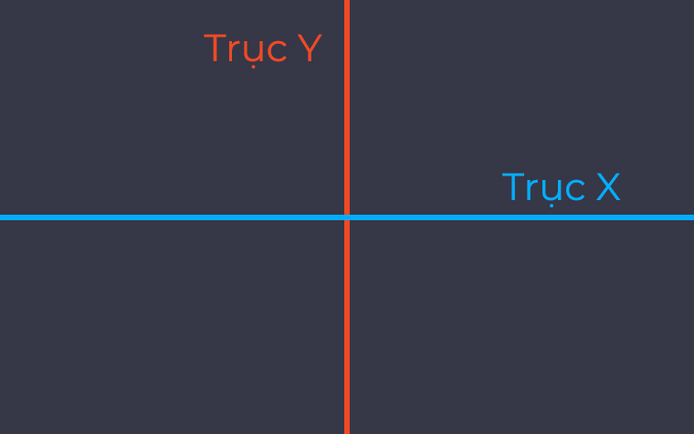
</div>

Mặc định thì những items trong flexbox được sắp xếp theo trục X và từ trái qua phải. Đó là lý do vì sao khi mình dùng display: flex ở ví dụ ở trên đầu thì các items được sắp xếp thành hàng ngang và hiển thị từ trái qua phải.

### Trong flex-direction có 4 giá trị bao gồm: 
- `flex-direction: row` là giá trị mặc định trong `flex-direction` các items sẽ được sắp xếp theo chiều ngang(trục X) và hiển thị từ trái sang phải.
<div style="width: 100%; text-align:center">
  
</div>

- `flex-direction: row-reverse` cũng giống như thuộc tính `flex-direction: row` nhưng những items sẽ được hiển thị từ phải qua trái
<div style="width: 100%; text-align:center">
  
</div>

- `flex-direction: column` các items được sắp xếp chiều dọc(trục Y) và hiển thị từ trên xuống dưới
<div style="width: 100%; text-align:center">
  
</div>

## 3. Flex-wrap:
>Các bạn nhớ resize trình duyệt ở những demo codepen ở dưới đây để thấy sự khác nhau nha.

Cho phép các items tự động xuống hàng hoặc vẫn luôn nằm trên cùng một hàng khi kích thước container thay đổi. Hơi khó hiểu nhỉ, xem demo dưới đây nha.

### Flex-wrap có 3 giá trị đó là:
1. `flex-wrap: nowrap` mặc định là nowrap nên các bạn không cần phải set. Khi chúng ta resize trình duyệt lại nếu các bạn sử dụng thuộc tính `flex-wrap: nowrap` thì các items sẽ tự động co lại cho chớ không có rớt xuống hàng, điều này dễ làm cho content bên trong(nếu có) bị ép lại có thể gây xấu giao diện.
``` css 
.box {
  display: flex;
  width: 100%;
  background-color: #1a1c28;
  flex-wrap: nowrap; -> /* mặc định nên không cần set*/
}
```
<div style="width: 100%; text-align:center">
  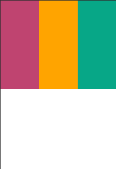
</div>

2. `flex-wrap: wrap` ngược lại so với `flex-wrap: nowrap` khi kích thước `container` thay đổi và tổng chiều rộng các items cộng lại lớn hơn chiều rộng của `container` bọc ngoài thì nó sẽ rớt xuống.

``` css 
.box {
  display: flex;
  width: 100%;
  background-color: #1a1c28;
  flex-wrap: wrap;
}
```
<div style="width: 100%; text-align:center">
  
</div>

3. Cuối cùng là `flex-wrap: wrap-reverse` cũng tương tự như `flex-wrap: wrap ` nhưng nó ngược lại thay vì item rớt xuống thì nó rớt lên. Resize trình duyệt phát hiểu ngay.
``` css 
  .box {
    display: flex;
    width: 100%;
    background-color: #1a1c28;
    flex-wrap: wrap-reverse;
  }
```
<div style="width: 100%; text-align:center">
  
</div>
## 4. Flex-flow:
Trong CSS, flex-flow là một thuộc tính điều chỉnh cách các phần tử con trong một container flex sắp xếp và xuất hiện. Thuộc tính này kết hợp hai thuộc tính khác là flex-direction và flex-wrap, cho phép xác định hướng xếp và cách xử lý khi các phần tử con vượt quá kích thước của container.
``` css
  flex-flow: <flex-direction> || <flex-wrap>;
```
- `<flex-direction>` xác định hướng xếp của các phần tử con, có thể là `row`, `row-reverse`, `column`, hoặc `column-reverse`.
- `<flex-wrap>` xác định cách xử lý khi các phần tử con vượt quá kích thước của container, có thể là `nowrap`, `wrap`, hoặc `wrap-reverse`.

## 5. Justify-content:
Thuộc tính này cho phép các bạn căn chỉnh các phần tử theo chiều ngang hoặc chiều dọc tùy thuộc vào thuộc tính flex-direction ở bài trước.

### Trong justify-content có 5 giá trị đó là:
#### **Trường hợp đầu tiên là khi làm với `flex-direction: row`. Lúc này những phần tử(items) sẽ được căn chỉnh theo chiều ngang.**

>Các bạn nhớ thay những giá trị này vào thuộc tính `justify-content` trong Codepen hoặc code của các bạn để dễ hình dung nhé.

1. `flex-start`: Giá trị mặc định trong thuộc tính `justify-content` khi sử dụng giá trị này thì những phần tử sẽ nằm sát lề bên trái của container
<div style="width: 100%; text-align:center">
  
</div>

2. `flex-end`: Sử dụng giá trị này thì các phần tử sẽ nằm sát lề bên phải, đừng nhầm với cái `row-reverse` nhá(`row-reverse` ở bài trước là đổi hướng hiển thị nhá.)
<div style="width: 100%; text-align:center">
  
</div>

3. `center`: Giá trị này làm cho các phần tử nằm giữa container.
<div style="width: 100%; text-align:center">
  
</div>

4. `space-between`: Giá trị này tạo khoảng cách giữa các phần tử bằng nhau, phần tử đầu tiên sát lề bên trái, phần tử cuối cùng sát lề bên phải, container sẽ tự động canh khoảng cách giữa các phần tử với nhau sao cho luôn bằng nhau.
<div style="width: 100%; text-align:center">
  
</div>

5. `space-around`: Giá trị này thì na ná `space-between` nhưng khác ở chỗ là có khoảng cách 2 bên giữa các phần tử và những khoảng cách này bằng nhau.
<div style="width: 100%; text-align:center">
  
</div>

Khoảng trống ở giữa gấp đôi là vì do khoảng cách giữa 2 ô gộp lại. 

#### **Trường hợp thứ 2 là khi làm việc với flex-direction: column. Thì lúc này justify-content sẽ căn chỉnh các phần tử theo chiều dọc. Các bạn xem Codepen dưới đây. Rồi mình sẽ đi qua từng giá trị như đã nói ở trên, các bạn có thể gõ code vào để hiểu hơn nha.**

>Bản chất thì cũng như flex-direction: row ở trên thôi nhưng theo chiều dọc, đễ dễ hình dung hơn các bạn để màn hình laptop đứng hoặc xoay cổ các bạn qua phải(90 độ) xem là nó y chang flex-direction: row.
<div style="width: 100%; text-align:center">
  
</div>

1. `flex-start`: Lúc này các phần tử được căn chỉnh theo chiều dọc rồi, nó sẽ nằm trên cùng của container như thế này.
<div style="width: 100%; text-align:center">
  
</div>

2. `flex-end`: Các phần tử sẽ nằm sát ở dưới cùng của container
<div style="width: 100%; text-align:center">
  
</div>

3. `center`: Các phần tử nằm giữa container theo chiều dọc như thế này
<div style="width: 100%; text-align:center">
  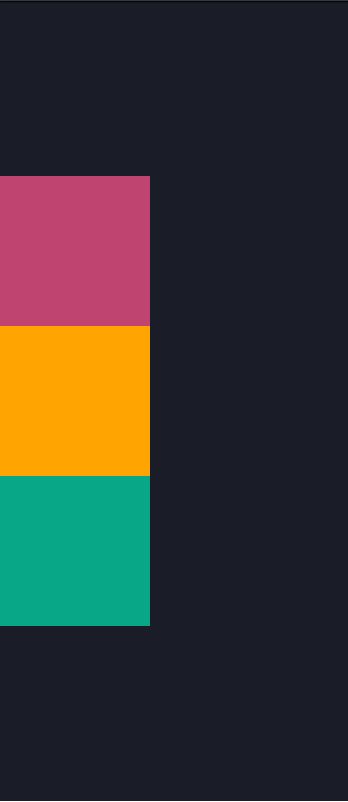
</div>

4. `space-between`: Canh đều khoảng cách giữa các phần tử, phần tử đầu tiên nằm trên cùng, phần tử cuối cùng nằm dưới cùng. Container sẽ tự động căn chỉnh các phần tử sao cho đều với nhau và đều với 2 phần tử trên dưới.
<div style="width: 100%; text-align:center">
  
</div>

5. `space-around`: cũng như mình giải thích ở trường hợp đầu tiên, nó cũng tương tự nhưng theo chiều dọc thôi. Thay vì 2 bên thì giờ là trên dưới của các phần tử bằng nhau.
<div style="width: 100%; text-align:center">
  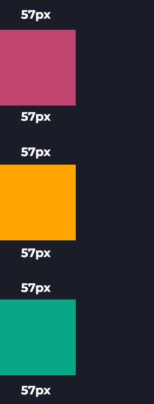
</div>

## 6. Align-items

Ngược lại với thuộc tính `justify-content` thì mặc định `align-items` canh các phần tử theo chiều dọc thay vì chiều ngang như `justify-content`. Tuy nhiên nếu đổi `flex-direction` sang column thì `align-items` sẽ canh theo chiều ngang.

1. Trường hợp đầu tiên khi làm việc với `flex-direction: row(mặc định)`. Các phần tử sẽ được canh theo chiều dọc. Trong `align-items` có 5 giá trị đó là `flex-start`, `flex-end`, `center`, `stretch(default)`, `baseline(typography)`

- Các bạn có thể xem ảnh GIF mình làm dưới đây cho dễ hình dung nha.
<div style="width: 100%; text-align:center">
  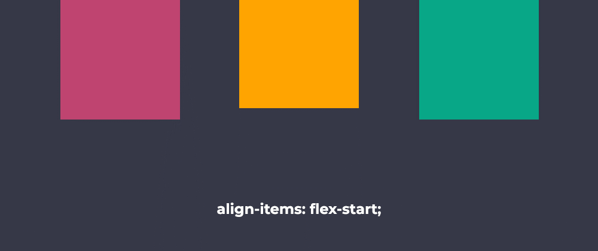
</div>

- Mặc định trong `align-items` là `stretch`, nếu các phần tử các bạn set height: auto thì nó sẽ cao full hết container chứa nó, nhưng nếu các bạn set height cố định thì nó sẽ đè lên thuộc tính `stretch` này và tất nhiên nó sẽ không cao full mà chỉ lấy giá trị height mà bạn set.
<div style="width: 100%; text-align:center">
  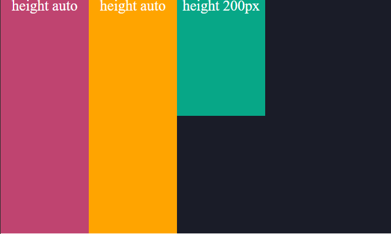
</div>

- Còn 1 giá trị khá khó hiểu đó là `baseline`, nghĩa là nó sẽ canh các phần tử với nhau dựa vào chữ bên trong(Dòng chữ đầu tiên thôi nhé).
<div style="width: 100%; text-align:center">
  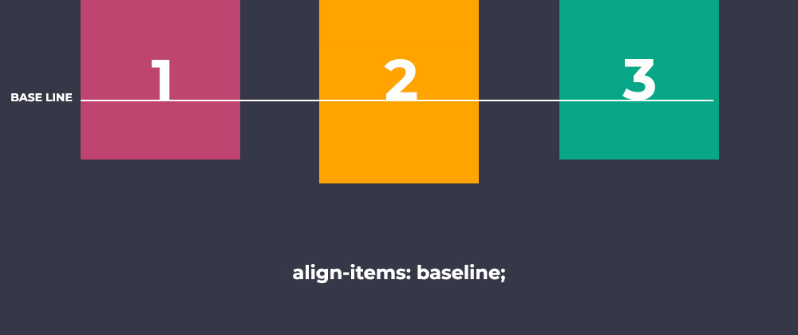
</div>

Ví dụ: https://codepen.io/evondev/pen/YjBdbE

2. Trường hợp thứ 2 khi làm việc với flex-direction: column. Các phần tử sẽ được canh theo chiều ngang. Cũng là 5 giá trị như trên. 
<div style="width: 100%; text-align:center">
  
</div>

Riêng giá trị baseline thì ở với trường hợp này nó không có tác dụng, nó chỉ canh baseline của các chữ theo chiều ngang khi ở flex-direction: row.

## 7. Align-self: 

`align-self` Thuộc tính  này tương tự với thuộc tính align-items ở trên nhưng khác ở chỗ là áp dụng riêng lẻ cho các phần tử mà bạn muốn thay đổi giá trị của nó.

### Các giá trị của align-self bao gồm:
1. flex-start: Phần tử con được căn về phía đầu của container.
2. flex-end: Phần tử con được căn về phía cuối của container.
3. center: Phần tử con được căn giữa theo chiều dọc của container.
4. baseline: Phần tử con được căn theo baseline của dòng văn bản trong container.
5. stretch: Phần tử con được kéo dài để lấp đầy chiều cao của container.
<div style="width: 100%; text-align:center">
  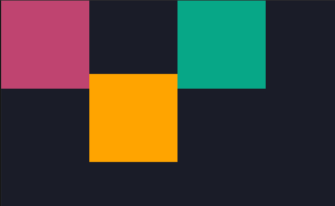
</div>

Ví dụ: https://codepen.io/evondev/pen/MGPpmO

## 8. Align-content
Trong CSS, align-content là một thuộc tính của container flexbox, được sử dụng để kiểm soát cách phần tử con được căn chỉnh theo trục chính của container khi chúng phân bố trên nhiều dòng hoặc cột. Thuộc tính này chỉ hoạt động khi có không gian trống trong container theo trục chính sau khi các phần tử con đã được căn chỉnh theo thuộc tính align-items.
``` css
align-content: stretch | flex-start | flex-end | center | space-between | space-around;
```
- stretch: Các dòng hoặc cột được căn chỉnh để căng ra trên toàn bộ không gian trống.
- flex-start: Các dòng hoặc cột được căn chỉnh về phía bắt đầu của container.
- flex-end: Các dòng hoặc cột được căn chỉnh về phía cuối của container.
- center: Các dòng hoặc cột được căn chỉnh vào giữa của container.
- space-between: Các dòng hoặc cột được căn chỉnh sao cho có khoảng trống đều nhau giữa chúng.
- space-around: Các dòng hoặc cột được căn chỉnh sao cho có khoảng trống đều nhau xung quanh chúng.

## 9. Order
Thuộc tính này cho phép đổi vị trí hiển thị của các phần tử.

```css
.box {
  display: flex;
  width: 100%;
  height: 800px;
  background-color: #1a1c28;
	flex-direction: column;
}
.item {
  width: 150px;
  height: 150px;
	line-height: 150px;
	text-align: center;
	font-size: 29px;
	color: white;
}
.item:nth-of-type(1) {
  background-color: #bf4470;
}
.item:nth-of-type(2) { 
  background-color: #ffa400;
	order: 1;
}
.item:nth-of-type(3) {
  background-color: #07a787;
}
```

Mặc định giá trị của thuộc tính order là 0.  Trong demo của mình có 3 thẻ div tương ứng màu tím vàng xanh lá.  Nhưng mình muốn màu xanh lá nằm giữa màu tím và vàng.

Thì mình sẽ cho order của màu xanh là 1 và màu vàng sẽ là 2. Hoặc chỉ cần cho màu vàng order 1 thôi là đủ vì lúc này 2 thẻ div màu tím và xanh lá mặc định là 0 nên nó sẽ nằm yên. Màu vàng thế chỗ màu xanh lá nên xanh lá sẽ xuống giữa như ý bạn muốn.


## 10. Flex-basis

Set chiều rộng hoặc chiều cao của phần tử dựa vào `flex-direction row` hay `column`. Mặc định là `flex-direction: row` cho nên lúc này `flex-basis` sẽ tương ứng với thuộc tính `width` của phần tử và khi `flex-direction: column` thì lúc này `flex-basis` sẽ là `height` của phần tử.
<div style="width: 100%; text-align:center">
  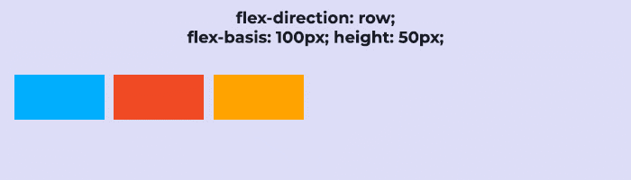
</div>

- Thuộc tính flex-basis sẽ đè lên thuộc tính width hoặc height của phần tử tùy thuộc vào giá trị của flex-direction. Các bạn có thể thay giá trị cho flex-direction vào Codepen dưới đây để hiểu hơn nha.

- Ví dụ: [https://codepen.io/evondev/pen/zLQWNw](https://codepen.io/evondev/pen/zLQWNw)

## 11. Flex-grow
Thuộc tính này khá là phức tạp, nó cho các phần tử giãn theo độ rộng của container, để mình giải thích cho các bạn qua từng hình ảnh nha. Đầu tiên mình cho các phần tử có độ rộng là 120px.
<div style="width: 100%; text-align:center">
  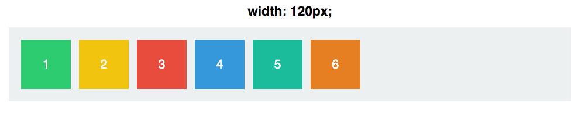
</div>

Mặc định giá trị trong thuộc tính flex-grow là 0. Nghĩa là các phần tử sẽ không tự động co giãn kích thước khi chiều rộng của container bao ngoài thay đổi. Hơi khó hiểu nhỉ ? Để mình tăng flex-grow lên 1 cho các phần tử coi sao.
<div style="width: 100%; text-align:center">
  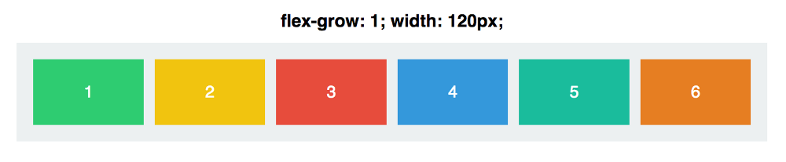
</div>

Wow. Các phần tử tự động giãn ra đều nhau sao cho vừa với khung container luôn, hay thật. Ủa vậy flex-grow: 1 là gì nhỉ, mình tăng lên 999 có sao không ? Không có bị gì luôn.
<div style="width: 100%; text-align:center">
  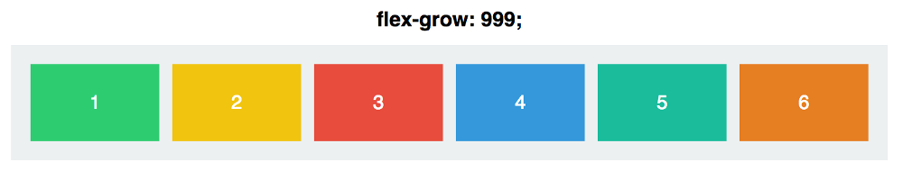
</div>

Giá trị của flex-grow rất là linh động chứ không tuyệt đối nghĩa là khi set giá trị flex-grow cho các phần tử thì các phần tử đều có tỉ lệ với nhau. Ví dụ set tất cả các phần tử flex-grow là 1 thì tất cả đều như nhau tỉ lệ 1:1, nếu set 999 cho toàn bộ thì cũng vậy vì bằng nhau hết mà đơn giản về hết cũng là 1:1.

- Ví dụ: [https://codepen.io/evondev/pen/KBLobN](https://codepen.io/evondev/pen/KBLobN)

Nhưng mà giả sử set các phần tử đều là flex-grow: 1, nhưng set riêng phần tử thứ 3 giá trị khác thì sẽ như thế nào nhỉ ?
<div style="width: 100%; text-align:center">
  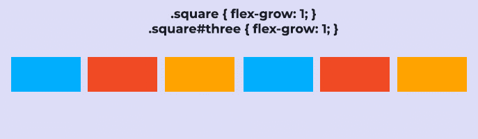
</div>

Chỗ này có áp dụng toán học nên mình sẽ giải thích cho các bạn hiểu. Bây giờ mình có 6 phần tử, ta set flex-grow: 1 cho các phần tử thì các phần tử sẽ bằng nhau vì container sẽ chia đều cho 6. Mỗi phần tử sẽ chiếm 1/6 đúng không nào ?

Nhưng khi mình tăng ô số 3 lên flex-grow: 2. Thì lúc này giá trị của flex-grow của các phần tử cộng lại sẽ là 7 cho nên container sẽ chia đều cho 7 vì 1 + 1 + 2 + 1 + 1 + 1. Ô số 3 có flex-grow: 2 nên sẽ chiếm 2/7 của container còn các phần tử còn lại chiếm 1/7.
- Ví dụ: [https://codepen.io/evondev/pen/PBvewq](https://codepen.io/evondev/pen/PBvewq)

Khi tăng ô số 3 lên flex-grow:3. Thì giá trị flex-grow của các phần tử cộng lại sẽ là 8 và container sẽ chia đều cho 8(1+1+3+1+1+1). Ô số 3 sẽ chiếm 3/8 và các ô còn lại chiếm 1/8. Và cứ thế tiếp tục nếu các bạn tăng.

Như đã nói ở trên thuộc tính flex-grow làm cho các phần tử tỉ lệ với nhau. Giả sử các phần tử đều có flex-grow: 4 và ô số 3 có thuộc tính flex-grow: 12 thì nó cũng tương tự như là 1 với 3.
<div style="width: 100%; text-align:center">
  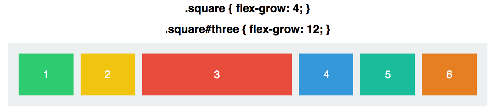
</div>

>Tips của mình hay dùng cho dễ hiểu đó là cứ lấy cái giá trị flex-grow của cái ô có số to nhất chia cho ô có số nhỏ nhất thì sẽ ra được tỉ lệ các phần tử so với nhau. Như ở trên 12/4 được 3 suy ra các ô còn lại sẽ bằng 1/3 ô lớn nhất.

Một điều nữa là khi dùng với flex-direction: column thì flex-grow sẽ giãn theo chiều dọc và lúc này nó sẽ là height(chiều cao) chớ không phải chiều rộng(width) nha. Cái này các bạn áp dụng tương tự để tự luyện tự hiểu cho mau lên trình nha.

## 12. Flex-shrink

Thuộc tính này thì nó ngược lại so với thuộc tính flex-grow ở trên, nó không giãn ra mà lại co lại khi chúng ta thay đổi độ rộng của container xuống. Mặc định giá trị trong flex-shrink là 1 nghĩa là cho phép các phần tử co lại khi độ rộng container giảm xuống.
<div style="width: 100%; text-align:center">
  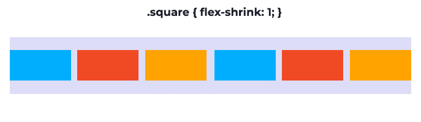
</div>

Các bạn thấy chứ các phần tử nó sẽ co lại khi chúng ta resize trình duyệt nhỏ xuống. Nhưng nếu các bạn set cho nó flex-shrink: 0 thì nó sẽ không co giãn và lúc này nó sẽ lấy giá trị của thuộc tính width.

- Ví dụ: [https://codepen.io/evondev/pen/ajrGda](https://codepen.io/evondev/pen/ajrGda)

Ở đây các bạn thấy phần tử số 3 có flex-shrink: 0. Thì khi co giãn lại tới ngưỡng độ rộng 120px(thuộc tính width) của nó thì nó vẫn sẽ giữ độ rộng đó chứ không co lại hơn nữa như các phần tử có flex-shrink: 1. Mình có note trong Codepen ở trên. Các bạn vào test xem đúng không nhá.
<div style="width: 100%; text-align:center">
  
</div>

Cũng như flex-grow thì trong flex-shrink các phần tử cũng tỷ lệ với nhau nha. Phần tử A có flex-shrink: 6 và các phần tử còn lại có flex-shrink: 2. Thì cũng tương tự là 3:1. Ủa nếu ô có flex-shrink: 3 còn các ô khác flex-shrink: 1 thì khi co lại nó sẽ có độ rộng bằng 1/3 so với những cái còn lại à ?

Trước khi đi sâu vào giải thích thì mình xin giới thiệu thêm 1 thuộc tính khác nữa trước đã nhé. Đó là flex(thuộc tính nhá)

## 13. Flex
Flex là viết tắt của 3 thuộc tính flex-grow flex-shrink và flex-basis. Nó như thế này. flex: flex-grow flex-shrink flex-basis. Mặc định grow(0) shrink(1) và basis(auto).

Các bạn xem ví dụ dưới đây cả hai đều có flex-basis như nhau. Nhưng mà ở box1 thì lại có flex-grow:2 nghĩa là box1 sẽ dài gấp đôi box2 khi độ rộng container giãn ra. Nhưng box2 thì lại có flex-shrink:2 nghĩa là khi container nhỏ xuống thì box2 sẽ co lại và có chiều dài bằng 1/2 box1 đúng không nhỉ ?
<div style="width: 100%; text-align:center">
  
</div>

Chỗ này sao mà rối loạn quá ? Sao trong hình GIF lúc container giãn ra mình thấy box1 có gấp đôi box2 đâu hay khi co container lại box2 có bằng 1/2 box1 đâu. Đây chính là điểm luôn làm mình cũng như các bạn rối não khi làm việc với flexbox

Khi kết hợp 2 giá trị flex-shrink và flex-grow lại với nhau thì phức tạp lắm, không chỉ là tỉ lệ về các con số đâu mà là về tốc độ grow(giãn ra) hay shrink(co lại) nữa đó. Nào cùng vào phần hại não phía dưới nha.

## 14. Giải thích grow và shrink khi kết hợp

Giả sử ban đầu ta có container có độ rộng tối đa là 640px sau khi tính toán bao gồm padding 2 bên của container. Lúc này có 2 phần tử như ở trên có flex-basis là 300px(bằng nhau về chiều rộng).

- Ví dụ: [https://codepen.io/evondev/pen/XBwqVx](https://codepen.io/evondev/pen/XBwqVx)

Khi các bạn resize trình duyệt lại sao cho container còn 430px thì lúc này chúng ta sẽ mất là 640 – 430 =  210px. Ô số 1 do có flex-shrink: 1 nên nó mất 70px(chiều rộng của nó bây giờ sẽ là 300 – 70 = 230px), còn ô số 2 có flex-shrink: 2 nên sẽ mất đi 140px(chiều rộng sẽ còn 300 – 140x = 160px).

Các bạn lại resize trình duyệt tiếp cho đến khi độ rộng container xuống 340px thì chúng ta mất 640 – 340  = 300px. Ô số 1 có flex-shrink: 1 nên sẽ mất 100px(còn 200px) còn ô số 2 sẽ mất 200px(còn 100px) do có flex-shrink: 2.

Tương tự với flex-grow. Khi tăng độ rộng container lên 940px. Thì container được tăng thêm 300px(640 + 300 = 940). Ô số 1 có flex-grow: 2 nên sẽ tăng lên thêm 200px(tổng sẽ là 500px) còn ô số 2 có flex-grow: 1 nên sẽ chiếm 1/3 là 100px nên nó sẽ tăng thêm độ rộng 100px(tổng sẽ là 400px).
<div style="width: 100%; text-align:center">
  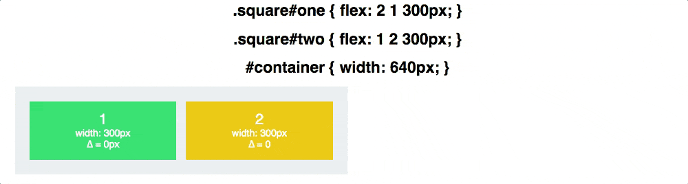
</div>

>Các bạn nên inspect các phần tử trong Codepen để xem sự thay đổi. Khi độ rộng container giảm xuống so với ban đầu thì chúng ta tính theo flex-shrink và ngược lại khi độ rộng container tăng lên so với ban đầu thì tính theo flex-grow. Phần tăng lên hay giảm xuống của container sẽ chia tỉ lệ cho flex-shrink hay flex-grow tương ứng của các phần tử

- Ví dụ: [https://codepen.io/evondev/pen/yqWEeG](https://codepen.io/evondev/pen/yqWEeG)

## 15. Bài tập về nhà
Hoành thành 24 bài tập trong code game:

Bài 1: Flexboxfroggy: [https://flexboxfroggy.com/#vi](https://flexboxfroggy.com/#vi)

Bài 2: Hoàn thành các bài tập đã giao hôm trước có sử dụng các kiến thức từ trước đến nay.

Bài 3: Nếu xong hết bài tập 2 thì làm thêm bài 3. 
  


