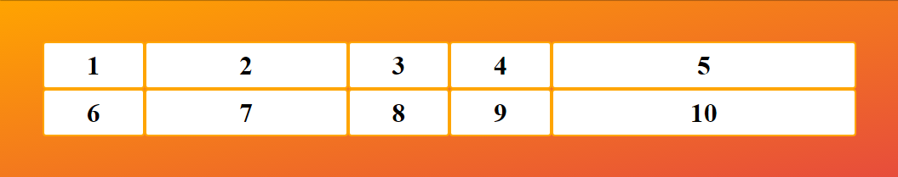

# Grid

## Nội dung bài học:
1. Css Grid.
2. Grid tracks.
3. Grid-template-columns.
4. Fraction-unit.
5. Grid-template-rows.
6. Grid implicit và explicit tracks.
7. Grid-auto-flow.
8. Grid-gap.
9. Repeat.
10. Grid-column.
11. Grid-row.
12. Grid-template-areas.
13. Minmax.
14. Grid-auto-flow: dense (Nâng cao).
15. Auto-fit vs auto-fill.
16. Thực hành.
17. Bài tập về nhà.

Flexbox thì có thể tạo hầu hết các layout cơ bản. Tuy nhiên ứng dụng web ngày nay giao diện ngày càng phức tạp nên việc chỉ sử dụng flexbox thực sự vẫn chưa tối ưu, cần nhiều giải pháp hơn để tạo ra layout một cách nhanh nhất , đẹp mà lại không tiêu tốn nhiều sức. 

Vì thế mà CSS Grid được sinh ra để giải quyết vấn đề này. Việc tạo layout không còn khó khăn nữa với CSS Grid ta có thể làm được nhiều layout phức tạp một cách dễ dàng, nhanh chóng tuy nhiên nó cũng chưa được nhiều trình duyệt hỗ trợ như flexbox nên việc sử dụng vẫn còn chưa rộng rãi.

## 1. CSS Grid:
Để sử dụng Grid thì đơn giản chúng ta dùng thuộc tính `display: grid;` thế là chúng ta đã dùng grid rồi giống như `flexbox display: flex;` vậy. 

Đầu tiên mình tạo layout HTML như sau:
``` html
<div class="container">
  <div class="item item1">1</div>
  <div class="item item2">2</div>
  <div class="item item3">3</div>
  <div class="item item4">4</div>
  <div class="item item5">5</div>
  <div class="item item6">6</div>
  <div class="item item7">7</div>
  <div class="item item8">8</div>
  <div class="item item9">9</div>
  <div class="item item10">10</div>
</div>
```
Và kèm theo đó là CSS
``` css
.container {
  background-image: linear-gradient(to right bottom, #ffa400, #e74c3c);
  height: auto;
  padding: 50px;
  display: grid;
  grid-template-columns: 500px 200px;
}
.item {
  color: black;
  font-weight: bold;
  font-size: 2rem;
  text-align: center;
  padding: 10px;
  background-color: #fff;
  border-radius: 4px;
  border: 2px solid orange;
}
```
Link ví dụ: [https://codepen.io/evondev/pen/qMOJam](https://codepen.io/evondev/pen/qMOJam)

## 2. grid tracks:
Grid tracks hiểu nôm na là các đường được đánh dấu theo thứ tự theo các cột và các hàng để thiết lập vị trí cho các phần tử một cách dễ dàng hơn. Mình khuyến khích các bạn mở Firefox lên để Inspect Code(F12) của demo Codepen ở trên để thấy các grid tracks một cách rõ ràng nhất nha


Các đường đánh dấu theo hàng và cột tương ứng từ trên cùng hoặc ngoài cùng bên trái. Cách để nhớ đơn giản là cứ lấy số cột + 1 sẽ ra tổng tracks theo cột và số hàng + 1 sẽ ra tổng tracks theo hàng. Các bạn thấy đó có 2 cột thì có 3 tracks line cột đánh dấu 1 2 3, còn 5 hàng thì 6 tracks line hàng. -1 là cuối cùng.

Ở đây các bạn chỉ cần hiểu nó là các đường như hình trên là được. Ở bài sau mình sẽ nói chi tiết về công dụng rất quan trọng của nó trong việc tạo layout như thế nào. Do CSS Grid khá nhiều thuộc tính nên mình không gom vào một bài được.

## 3. grid-template-columns:
Columns đúng như tên gọi là cột, khi sử dụng thuộc tính này grid container sẽ chia cột cho các phần tử bên trong nó. Ở đây các bạn có thể chia bao nhiêu cột tùy các bạn, thường dựa vào design thiết kế là 12 cột bằng nhau, có khi 8….

Ví dụ ở đây mình có 10 phần tử, mình muốn chia mỗi cột có 2 phần tử thì mình sẽ chia cho 5 cột. Đơn vị ở đây các bạn có thể dùng px, %, em rem, auto hay gì tùy các bạn. Tuy nhiên ở đây có một giá trị mới chỉ dùng trong css grid đó là fr(fractional unit). Giá trị này mình sẽ giải thích ở một phần sau nha.

```css
.container {
 grid-template-columns: 20% 20% 20% 20% 20%;
}
```


``` css
.container {
 grid-template-columns: 200px 300px 100px 50px auto;
}
```


```css
.container {
 grid-template-columns: 1fr 2fr 1fr 1fr 3fr;
}
```


Các bạn muốn chia bao nhiêu cột thì cứ điền vô thêm như thế này grid-template-columns: cột1 cột2 cột3.... cộtN tương ứng grid-template-columns: 10px 100px 1fr auto... Đấy các bạn nên áp dụng thử xem để mau hiểu hơn nha, dùng cái Codepen của mình ở trên có note sẵn cho các bạn để điền vào thử rồi á chớ đọc không mà không làm là mù màu với nó đấy.

## 4. fraction-unit
Đây là một giá trị mới và dùng trong CSS Grid nha các bạn. Giá trị này sẽ chiếm khoảng trống lớn nhất có thể để mình giải thích cho các bạn dễ hiểu nà. Giả sử container có độ rộng là 100% và lúc này grid-template-columns: 1fr thì sẽ tạo ra một cột là 100%. Nên các phần tử sẽ nằm cùng một cột như dưới đây

ví dụ : [https://codepen.io/evondev/pen/mGPrXE](https://codepen.io/evondev/pen/mGPrXE)

Tuy nhiên nếu mình thêm vài đơn vị fr vào nữa lúc này sẽ là grid-template-columns: 1fr 2fr 1fr chẳng hạn thì layout nó sẽ tạo ra 3 cột với cột giữa là 2fr sẽ gấp đôi 2 cột còn lại. Nghĩa là container 100% sẽ chia cho 4 và cột đầu tiên và cột cuối cùng sẽ chiếm 25% còn 50% còn lại là cột ở giữa.

```css
.container {
 grid-template-columns: 1fr 2fr 1fr;
}
```


Các bạn có thấy nó quen quen không, khá là giống cái thuộc tính flex-grow trong css flexbox. Khác cái là đây nó áp dụng cho grid và để chia cột nhá nên đừng hiểu nhầm nha.

## 5. grid-template-rows
Cũng tương tự như grid-template-columns nhưng thuộc tính này là chia hàng(row). Các bạn có thể chia container thành nhiều hàng tùy vào thiết kế hoặc có thể không cần set, để tự động(auto) cũng được.

Link ví dụ: [https://codepen.io/evondev/pen/aaNmgo](https://codepen.io/evondev/pen/aaNmgo) 

Các bạn thấy nó cũng khá đơn giản chứ nhỉ. Các bạn có thể tạo bao nhiêu hàng tùy ý và có thể dùng các đơn vị như ở thuộc tính grid-template-columns mà mình đã nói ở trên. Ở đây mình có 10 phần tử thì mình muốn chia thành 3 cột và 3 hàng thì nó sẽ như thế này. Và các bạn để ý là sẽ có 1 phần tử số 10 rớt xuống thì nó sẽ có độ cao là auto.


Tuy nhiên còn một phần tử cuối cùng nó không còn chỗ vì chia 3 cột 3 hàng thì được 9 phần tử thôi nên nó sẽ tự động rớt xuống tạo nên đường Implicit Tracks. Trong grid có 2 khái niệm về tracks đó là Implicit và Explicit, vậy nó là gì ? Các bạn kéo xuống dưới đọc để hiểu nha.

## 6. grid implicit và explicit tracks:
Hai đường này hơi lằng nhằng chút nhưng cũng dễ hiểu thôi thường khi làm mình không để ý lắm, nhưng viết bài thì mình phải nói rõ cho các bạn biết thêm. Như phần trên mình nói do có 10 phần tử, mà mình chỉ tạo 3 cột 3 hàng thì phần tử cuối sẽ rớt xuống tạo thành 1 hàng mới.


Các bạn mở giúp mình cái Codepen ở phần grid-template-rows lên bằng Firefox rồi F12 mở layout Grid lên được như hình trên. Các bạn zoom trình duyệt lên cho thấy rõ là có 1 đường đen ở trên cùng và những đường có dấu gạch ngang – cho tới một đường đen ở hàng số 4 đây chính là Explicit Tracks.

Còn một đường dấu … ở hàng số 5 đó là do container không đủ chỗ chứa cho phần tử số 10 nên nó rớt xuống tạo nên 1 hàng mới và tạo nên đường dấu… chứ không phải đen hay gạch ngang – như ở Explicit Tracks đây chính là Implicit Tracks.

Hai đường này giúp chúng ta nhận biết được vị trí của các phần tử để hiển thị cho đúng nha anh em. Để việc chia cột hay hàng trong layout được hiển thị chính xác nhé.

## 7. grid-auto-flow:
Như ở trường hợp trên khi có một hoặc nhiều phần tử bị dư do không đủ cột hay hàng thì nó sẽ rớt xuống tạo nên hàng mới. Thì mình muốn set cho các phần tử bị rớt ra tạo nên Implicit Tracks có chiều cao nhất định nào đó. Chúng ta sẽ dùng thuộc tính grid-auto-flow: row kết hợp với thuộc tính grid-auto-rows để set cho các phần tử đó

Link ví dụ: [https://codepen.io/evondev/pen/GXZNrO](https://codepen.io/evondev/pen/GXZNrO)

Ở đây mình muốn cho phần tử số 10 khi rớt xuống tạo nên hàng mới có chiều cao là 100px thì mình set grid-auto-rows: 100px. Các bạn xem demo Codepen là sẽ hiểu ngay thôi.

Còn nếu các bạn muốn các cột đều nằm trên một hàng và tạo thành nhiều cột khác cho dù ban đầu bạn chỉ set có 2 cột mà thôi thì cũng tương tự chúng ta sử dụng thuộc tính grid-auto-flow: column nhưng giá trị là column.

Mình muốn các cột được tạo thêm đều bằng nhau và có giá trị là 250px thì mình sẽ code như thế này

```css
.container {
 grid-template-columns: 100px 200px; 
 grid-auto-flow: column;
 grid-auto-columns: 250px;
}
```
Nếu các bạn bỏ thuộc tính grid-template-columns ra thì nó cũng sẽ tự động tạo ra các cột tương ứng với số phần tử và độ rộng các cột là 250px.

Link ví dụ: [https://codepen.io/evondev/pen/wEGoqx](https://codepen.io/evondev/pen/wEGoqx)

## 8. grid-gap
Thuộc tính này giúp chúng ta tạo khoảng cách giữa các phần tử với nhau theo cột và hàng. Thuộc tính này bao gồm thuộc tính grid-row-gap và grid-column-gap được viết như sau grid-gap: grid-row-gap grid-column-gap.

Các bạn có thể thấy hình minh họa dưới đây mình cho grid-gap: 20px. Nó sẽ tạo khoảng cách giữa các phần tử 20px theo cột và hàng luôn rất đều và đẹp


## 9. repeat
Hàm này giúp chúng ta tạo nhiều cột hoặc hàng có cùng giá trị một cách nhanh chóng. Ở bài trước khi chúng ta muốn tạo 5 cột bằng nhau thì chúng ta sẽ dùng grid-template-columns: 20% 20% 20% 20% 20% đúng không nào.

Thì với hàm repeat() mà CSS Grid cung cấp thì chúng ta có thể viết nó như thế này grid-template-columns: repeat(5, 20%) trong đó 5 là số cột muốn tạo còn 20% là đơn vị chúng ta sẽ dùng.

Nếu bạn muốn tạo 6 cột có cột đầu tiên và cột cuối cùng độ rộng là 10% còn 4 cột ở giữa mỗi cột 20% thì đơn giản chúng ta viết thế này grid-template-columns: 10% repeat(4,20%) 10%.

Link ví dụ: [https://codepen.io/evondev/pen/rZwxJB](https://codepen.io/evondev/pen/rZwxJB)

## 10. grid-column
Thuộc tính này giúp chúng ta thiết lập vị trí và kích thước của phần tử theo cột. Nó là viết tắt của 2 thuộc tính grid-column-start và grid-column-end. Cú pháp của nó như sau grid-column: grid-column-start / grid-column-end.

Trong đó giá trị của grid-column-start và grid-column-end là các tracks line( mình có giải thích ở bài trước rồi đó) bài này sẽ áp dụng chúng vào thực tế.

```html
<div id="grid">
  <div id="item1"></div>
  <div id="item2"></div>
  <div id="item3"></div>
</div>
```

``` css
#grid {
  display: grid;
  height: 200px;
  grid-template-columns: repeat(6, 1fr);
  grid-template-rows: 200px;
}
#item1 {
  background-color: #07a787;
}
#item2 {
  background-color: #ffa400;
  grid-column: 2 / 4;
}
#item3 {
  background-color: #00aefd;
  grid-column: span 2 / 7;
}
```

Link ví dụ: [https://codepen.io/evondev/pen/dqRGEz](https://codepen.io/evondev/pen/dqRGEz)


>Ở phần trên có nói về các đường tracks giờ mình xin giải thích thêm một chút là từ trái qua(theo cột) hoặc từ trên xuống(theo hàng) thì các số được đánh số từ 1 và tăng dần. Còn từ phải qua(theo cột) hoặc từ dưới lên(theo hàng) thì các số được đánh dấu từ -1 và giảm dần.

Phần tử item1 mình cho background màu xanh và không set gì hết nên nó nằm ở track line số 1. Còn phần tử item2 mình cho background màu vàng và có grid-column: 2 / 4 nghĩa là nó sẽ bắt đầu từ track line số 2 tới track line 4 như các bạn thấy ở hình trên.

Còn phần tử item3 có một giá trị là lạ đó là span. Và với grid-column: span 2 / 7 nên nó sẽ chiếm 2 cột tính từ track line số 7 chạy từ phải qua trái. Giá trị span sẽ tương ứng số cột mà các bạn muốn. Ví dụ span 2 nó sẽ chiếm 2 cột, span 1 là một cột.

Ở đây có 2 trường hợp. Trường hợp 1 nếu giá trị span nằm ở đầu như thế này(grid-colum-start) grid-column: span 2 / 7 thì sẽ tính ngược từ phải qua trái bắt đầu từ line số 7 và span 2(chiếm 2 cột).

Trường hợp 2 nếu grid-column: 5 / span 2  giá trị span nằm ở sau(grid-column-end) thì cũng tạo ra kết quả y Codepen ở trên. Nhưng phần tử sẽ tính từ line số 5 và chiếm 2 cột. Kết quả đều như nhau.

## 11. grid-row
Cũng như trên nhưng thuộc tính này giúp chúng ta thiết lập vị trí và kích thước của phần tử theo hàng. Thuộc tính này được viết tắt của 2 thuộc tính grid-row-start và grid-row-end. Cú pháp của nó như thế này grid-row: grid-row-start / grid-row-end.
``` html
<div id="grid">
  <div id="item1"></div>
  <div id="item2"></div>
  <div id="item3"></div>
</div>
```

``` css
#grid {
  display: grid;
  height: 500px;
  grid-template-columns: 200px;
  grid-template-rows: repeat(6, 1fr);
}
#item1 {
  background-color: #07a787;
}
#item2 {
  background-color: #ffa400;
  grid-row: 2 / 4;
}
#item3 {
  background-color: #00aefd;
  grid-row: span 2 / 7;
}
```


Phần giải thích giống ở trên mục grid-column nhưng mà theo hàng nha. Các bạn đọc giải thích ở trên nhưng thay chữ “cột” bằng chữ “hàng” là oke nhé.

## 12. grid-template-areas
Thuộc tính cực kỳ hay và hữu ích cho phép chúng ta tạo bố cục layout một cách nhanh chóng, dễ dàng mà lại đơn giản. Để sử dụng thì mình có tạo demo như dưới đây.
``` html
<section id="page">
  <header>Header</header>
  <nav>Navigation</nav>
  <main>Main area</main>
  <footer>Footer</footer>
</section>
```

``` css
#page {
  display: grid;
  width: 100%;
  height: 250px;
  grid-template-areas: "head head"
                       "nav  main"
                       "nav  foot";
  grid-template-rows: 50px 1fr 30px;
  grid-template-columns: 150px 1fr;
}
#page > header {
  grid-area: head;
  background-color: #07a787;
}
#page > nav {
  grid-area: nav;
  background-color: #ffa400;
}
#page > main {
  grid-area: main;
  background-color: #00aefd;
}
#page > footer {
  grid-area: foot;
  background-color: #e74c3c;
}
```
Link ví dụ: [https://codepen.io/evondev/pen/aawZzG](https://codepen.io/evondev/pen/aawZzG)


Nếu các bạn làm biết cách phân tích bố cục layout một website thì quá đơn giản rồi. Chỉ cần vẽ ra giấy cấu trúc của nó mà thôi. Rồi sau đó dùng grid-template-areas: cấu trúc layout tương ứng với hình mà các bạn vẽ với từng vị trí hiển thị cũng như kích thước của chúng.

Các bạn nhìn vào code và có thể thấy rằng việc tạo bố cục layout bây giờ dường như khỏe hơn rất nhiều. Chỉ cần dùng grid-template-areas cho container và dùng grid-area cho các phần tử  hiển thị ở vị trí mà các bạn mong muốn.

Ở trên mình tạo bố cục layout có 2 cột và 3 hàng cho container và trong đó Header chiếm 2 cột ở trên cùng, Menu chiếm 1 cột và 2 hàng ở bên trái sau đó là Main content chiếm 1 cột + 1 hàng bên phải và cuối cùng là Footer chiếm một cột một hàng dưới cùng bên phải luôn.

Lưu ý nếu các bạn muốn Header chỉ chiếm một cột thôi còn cột thứ 2 bỏ trống thì các bạn dùng dấu chấm “.” vào grid-template-areas như thế này. Nếu các bạn bỏ trống thì nó sẽ không hoạt động nha. Vì thế nên cẩn thận khi làm nhé.

- Ví dụ:
```css
#grid {
  grid-template-areas: "head ."
                       "nav  main"
                       "nav  foot";
}
```
## 13. minmax
Hàm này giúp chúng ta thiết lập độ rộng của cột hoặc chiều cao của dòng theo giá trị tối thiểu và tối đa cho phần tử.

Chúng ta có thể sử dụng hàm này như thế này grid-template-columns: minmax(300px, 500px) sẽ tạo ra một cột trong đó giá trị 300px đầu tiên sẽ là độ rộng tối thiểu và 500px sẽ là độ rộng tối đa.

Dưới đây là một ví dụ nho nhỏ về hàm minmax. Các bạn xem demo kèm giải thích cho mau hiểu nha.

- Link ví dụ: [https://codepen.io/evondev/pen/LJLZdo](https://codepen.io/evondev/pen/LJLZdo)

Ở trên mình tạo ra 3 cột với cột đầu tiên có minmax(min-content, 300px) hàm này sẽ làm cho cột đầu tiên có độ rộng tối đa là 300px và độ rộng tối thiểu là min-content. Vậy min-content là cái gì vậy nhỉ ?

Ngoài min-content còn có max-content nữa. Mình sẽ giải thích sau nhé. Cột số 2 có minmax(200px, 1fr) sẽ tạo ra cột có độ rộng tối thiểu là 200px và tối đa là 1fr(free space). Giả sử container có độ rộng là 1000px nhé.

Cột đầu tiên chiếm tối đa 300px, cột thứ 3 chiếm 150px từ đó độ rộng của cột số 2 có 1fr suy ra nó chiếm 1000 – (300 + 150) = 550px. Vậy đấy. Thế min-content và max-content là gì?

Đúng như tên gọi là content nghĩa là nó sẽ phụ thuộc vào content bên trong phần tử theo ví dụ của mình thì nó sẽ phụ thuộc vào các đoạn text bên trong. Các bạn có thể check Codepen mình làm ở trên để biết nha.

Max-content thì content sẽ rộng ra hết mức có thể với demo Codepen(các bạn có thể thay giá trị min-content thành max-content để thấy kết quả nha) dù mình đã set minmax(max-content, 300px) rồi nhưng khi dùng với max-content thì content vẫn sẽ dài ra làm cho độ rộng của phần tử dài ra vượt qua độ rộng tối đa 300px luôn.

Min-content thì ngược lại nó sẽ nhỏ lại hết mức có thể. Khi các bạn co trình duyệt lại tới mức phần tử không còn độ rộng tối đa là 300px nữa với min-content thì content bên trong sẽ tự động thu nhỏ lại hết mức (phụ thuộc vào từ dài nhất) và tất nhiên các chữ sẽ rớt xuống rồi.

## 14. grid-auto-flow: dense (Nâng cao)
Ở bài trước mình có nói qua thuộc tính này kèm theo đó là hai giá trị row và column. Tuy nhiên còn một giá trị khác nữa đó là dense. Giá trị này sẽ làm cho các phần tử tự động fill vào các chỗ trống trong grid một cách hợp lý sao cho không bị dư khoảng trống.

Giá trị này sẽ làm cho các phần tử sắp xếp không còn theo thứ tự nữa miễn sao nó cố gắng fill đầy khoảng trống trong container mà thôi. Các bạn có thể tham khảo Codepen(codepen mình tham khảo) dưới đây là sẽ hiểu thôi nhé.

- Link ví dụ: [https://codepen.io/enxaneta/pen/QpjvBx](https://codepen.io/enxaneta/pen/QpjvBx)

## 15. auto-fit vs auto-fill
Hai giá trị thường được sử dụng trong hàm repeat() mà chúng ta đã tìm hiểu ở bài trước đó. Thật tình hai giá trị này mình không biết giải thích sao cho các bạn dễ hiểu được nên mình có tìm một bài trình bày rất chi tiết về hai giá trị này để cho các bạn tham khảo. Các bạn có thể [đọc nó tại đây nha](https://css-tricks.com/auto-sizing-columns-css-grid-auto-fill-vs-auto-fit/).

Để các bạn có thể hình dung và hiểu sự khác biệt giữa chúng nên mình có để thêm phần Codepen dưới đây để các bạn tham khảo nè. Lưu ý là các bạn phải bấm nút “Edit on Codepen” để vào trang Codepen xem cho chính xác và phải co giãn trình duyệt thì mới thấy được sự khác biệt nha.

- Ví dụ: [https://codepen.io/SaraSoueidan/pen/JrLdBQ](https://codepen.io/SaraSoueidan/pen/JrLdBQ)

## 16. Thực hành
Đây là phần hot nhất đây. Mình sẽ làm một demo kèm code cho các bạn theo dõi và làm theo luôn cũng như chia sẻ vài tips mà mình hay dùng khi làm cho các bạn. Đây là kết quả sau khi làm xong.


<div  style="text-align: center;">
  <i>Project từ Udemy</i>
</div>
Và điều trước tiên là các bạn phải làm đó là tải code mẫu của mình về ở đây. Sau đó mở lên và bắt đầu theo dõi bài này và code theo nhé. Mình có note trong file style.css đoạn /* Code follow from here*/ các bạn mở file style.css và kéo xuống dưới cùng nhé.

### Phân tích design
Kinh nghiệm của mình là tạo ra grid sao cho phù hợp. Mình bắt đầu đo kích thước của design và thấy rằng khoảng cách giữa các phần tử vàpaddingcủa gallery đều là 15px.

Thì việc đầu tiên mình làm đó là css cho gallerydisplay: grid đồng thời mình cũng set luôn grid-gap: 1.5rem và padding 1.5rem

>Lưu ý do mình set html font-size về 62.5% nên lúc này 1rem = 10px. Các bạn có thể tham khảo bài viết về hướng dẫn sử đụng đơn vị em và rem của mình trước đó để hiểu lý do tại sao nhé.

``` css
.gallery {
  background-color: #f9f7f6;
  padding: 1.5rem;
  grid-gap: 1.5rem;
  display: grid;
}
```

Tiếp đến mình nhìn vào tấm hình nhỏ nhất trong design. Mình có đánh dấu ô màu xanh trong hình dưới đây và mình thấy rằng kích thước của nó là 145x70(px). Và khung gallery là 1270px sau khi trừ đi padding 2 bên(30px) và các grid-gap(line màu đỏ) giữa các phần tử là 4×15(60) thì khung gallery còn 1270 - 30 - 60 = 1180px.


### Tạo lưới(grid) cơ bản
Sau khi đã có chiều rộng và độ cao của phần tử nhỏ nhất 145x70 và chiều rộng của gallery là 1180px. Giờ là bước tạo lưới chỗ này quan trọng nè các bạn nhớ làm theo nha.

>Xin lưu ý đây là cách làm của mình và mình chia sẻ cho các bạn. Nếu các bạn thấy không đúng hoặc có cách khác hay hơn thì góp ý giúp mình nha.

Mình sẽ lấy độ rộng của gallery là 1180 chia cho độ rộng của phần tử nhỏ nhất rồi làm tròn xuống ta được 1180/145 = 8. Từ đó ta tạo ra được 8 cột và mình sẽ cho các cột này đều bằng nhau vì thế code của mình lúc này sẽ có grid-template-columns: repeat(8, 1fr)

```css
.gallery {
    background-color: #f9f7f6;
    padding: 1.5rem;
    grid-gap: 1.5rem;
    display: grid;
    grid-template-columns: repeat(8, 1fr);
}
```
Còn về grid-template-rows thì mình cũng tính tương tự cho chiều cao của gallery sau khi trừ padding và các grid-gap ta được 540px. Ta lấy 540 chia cho chiều cao của phần tử nhỏ nhất là 70 và làm tròn xuống ta được 540/70 = 7. Từ đó sẽ có 7 hàng(row) ứng với chiều cao của phần tử nhỏ nhất là 70px(7rem)

``` css
.gallery {
    background-color: #f9f7f6;
    padding: 1.5rem;
    grid-gap: 1.5rem;
    display: grid;
    grid-template-columns: repeat(8, 1fr);
    grid-template-rows: repeat(7, 7rem);
}
```
Các bạn nhớ dùng Firefox rồi F12 lên chọn vào thẻ gallery rồi click vào cái thuộc tính display: grid mà mình có gạch chân màu đen dưới đây khi check code css nhá.


Sau khi click vào đó các bạn nhìn vào kết quả sẽ trông như thế này


### Căn chỉnh vị trí cho các phần tử

Bây giờ là bước sắp xếp vị trí cho các phần tử đúng nơi mà nó hiển thị. Các bạn nhớ làm bước trên để thấy các track line nhé. Vì nó rất quan trọng trong việc thiết lập vị trí cho các phần tử đó.


Đây là hình mà mình đã minh họa và phân tích ra cho các bạn tiện theo dõi và hình dung. Design này bao gồm tất cả là 14 hình.

Các số màu đỏ là vị trí tương ứng cho các hình, số màu đen là các track line để chúng ta xác định vị trí cột và hàng cho phần tử và màu xanh là tương ứng số cột và số hàng của phần tử đó chứa.

Các bạn nhớ tải hình này về để tiện theo dõi hơn chứ vừa đọc code vừa kéo chuột lên mất thời gian lắm đó. Giờ thì bắt đầu từng tấm một nhé. Trong source code mẫu thì đã có html css đặt tên đúng chuẩn rồi nhé.

>Đừng quên rằng track line mình đã nói rõ cho các bạn ở phần trước rồi nhé các bạn nhớ theo dõi thì mới hiểu, cột thì track line theo chiều ngang còn hàng thì track line theo chiều dọc.

**Tấm số 1**: Dựa vào hình ta thấy nó chiếm 2 cột và 2 hàng. Cột thì bắt đầu từ track line số 1 tới track line số 3 còn hàng thì từ track line số 1 tới track line số 3 luôn. Suy ra ta có

``` css
.gallery__item--1 {
  grid-column: 1 / 3;
  grid-row: 1 / 3;
}
```
**Tấm số 2** : Dễ dàng ta thấy theo cột thì nó bắt đầu từ line số 3 tới line số 6 và hàng thì bắt đầu từ line số 1 tới line số 4 nên ta có
``` css
.gallery__item--2 {
  grid-column: 3 / 6;
  grid-row: 1 / 4;
}
```
**Tấm số 3** : Cột từ line 6 – 7 còn hàng thì line 1 – 3
``` css
.gallery__item--3 {
grid-column: 6 / 7;
grid-row: 1 / 3;
}
```
**Tấm số 4** : Cột thì từ line 7 – 9 và hàng thì giống tấm số 3 từ line 1 – 3
``` css
.gallery__item--4 {
  grid-column: 7 / 9;
  grid-row: 1 / 3;
}
```
**Tấm số 5** : Cột từ line 1 – 3 và hàng thì từ line 3 tới line 6
``` css
.gallery__item--5 {
  grid-column: 1 / 3;
  grid-row: 3 / 6;
}
```
**Tấm số 6** : Ta lại thấy cột thì bắt đầu từ line số 3 – 5 và hàng thì từ line số 4 tới line số 6 nên ta cũng có
``` css
.gallery__item--6 {
  grid-column: 3 / 5;
  grid-row: 4 / 6;
}
```
**Tấm số 7** : Tiếp tục phân tích lại thấy theo cột thì nó nằm từ line số 5 – 6 và hàng thì từ line 4 - 5
```css
.gallery__item--7 {
  grid-column: 5 / 6;
  grid-row: 4 / 5;
}
```
**Tấm số 8** : Ez ta lại thấy nó nằm ở cột từ line số 6 – 8 và hàng thì từ line 3 – 5
``` css
.gallery__item--8 {
  grid-column: 6 / 8;
  grid-row: 3 / 5;
}
```
**Tấm số 9** : Sắp xong rồi cố lên. Cột nằm từ line số 8 đến line số 9 còn hàng thì từ line 3 – 6.
``` css
.gallery__item--9 {
  grid-column: 8 / 9;
  grid-row: 3 / 6;
}
```
**Tấm số 10** : Nó nằm đầu tiên thì theo cột tất nhiên là line số 1 tới line số 2 và hàng thì từ line số 6 – 8
``` css
.gallery__item--10 {
  grid-column: 1 / 2;
  grid-row: 6 / 8;
}
```
**Tấm số 11** : Xuất phát từ line số 2 tới line số 4 của cột và hàng cũng tương tự của tấm số 10 đó là 6 – 8
``` css
.gallery__item--11 {
  grid-column: 2 / 4;
  grid-row: 6 / 8;
}
```
**Tấm số 12**: Hàng thì cũng tương tự ở tấm số 11 là từ line 6 – 8 luôn còn cột thì từ line số 4 – 5
``` css
.gallery__item--12 {
  grid-column: 4 / 5;
  grid-row: 6 / 8;
}
```
**Tấm số 13** : Chút xíu nữa thôi. Nhìn kỹ ta thấy theo cột nó bắt đầu từ line 5 – 8 và theo hàng cũng từ line 5 – 8.
``` css
.gallery__item--13 {
  grid-column: 5 / 8;
  grid-row: 5 / 8;
}
```
**Tấm cuối cùng số 14** : oh yeah nó nằm cuối có line cột từ số 8 – 9 và line hàng từ 6 – 8 giống tấm số 12 nè
``` css
.gallery__item--14 {
  grid-column: 8 / 9;
  grid-row: 6 / 8;
}
```
Cuối cùng cũng xong rồi. Đây là fullsource code sau khi các bạn làm xong. Nhớ tham khảo và đối chiếu xem đúng không nè.

``` css
.gallery {
    background-color: #f9f7f6;
    padding: 1.5rem;
    grid-gap: 1.5rem;
    display: grid;
    grid-template-columns: repeat(8, 1fr);
    grid-template-rows: repeat(7, 7rem);
}
.gallery__img {
    width: 100%;
    height: 100%;
    object-fit: cover;
    display: block;
}
.gallery__item--1 {
  grid-column: 1 / 3;
  grid-row: 1 / 3;
}
.gallery__item--2 {
  grid-column: 3 / 6;
  grid-row: 1 / 4;
}
.gallery__item--3 {
  grid-column: 6 / 7;
  grid-row: 1 / 3;
}
.gallery__item--4 {
  grid-column: 7 / 9;
  grid-row: 1 / 3;
}
.gallery__item--5 {
  grid-column: 1 / 3;
  grid-row: 3 / 6;
}
.gallery__item--6 {
  grid-column: 3 / 5;
  grid-row: 4 / 6;
}
.gallery__item--7 {
  grid-column: 5 / 6;
  grid-row: 4 / 5;
}
.gallery__item--8 {
  grid-column: 6 / 8;
  grid-row: 3 / 5;
}
.gallery__item--9 {
  grid-column: 8 / 9;
  grid-row: 3 / 6;
}
.gallery__item--10 {
  grid-column: 1 / 2;
  grid-row: 6 / 8;
}
.gallery__item--11 {
  grid-column: 2 / 4;
  grid-row: 6 / 8;
}
.gallery__item--12 {
  grid-column: 4 / 5;
  grid-row: 6 / 8;
}
.gallery__item--13 {
  grid-column: 5 / 8;
  grid-row: 5 / 8;
}
.gallery__item--14 {
  grid-column: 8 / 9;
  grid-row: 6 / 8;
}
```

## 17. Bài tập về nhà
Chia grid theo mẫu sau yêu cầu dùng 2 cách (grid và grid-area).
