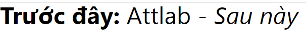
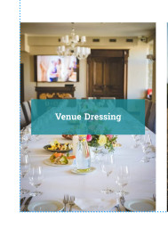

# Position
## Nội dung bài học:
1. Position.
2. Transform.
3. Transition.
4. Before và after.
5. Z-index.
6. Lưu ý khi dùng :pseudo và ::pseudo.
7. Animation.
8. Thực hành.

## 1. Position
Trong CSS, thuộc tính position được sử dụng để kiểm soát cách một phần tử được định vị trong HTML. Có các giá trị sau cho thuộc tính position:

- **static**: Đây là giá trị mặc định. Phần tử với `position: static` sẽ xuất hiện theo thứ tự trong luồng tài liệu và không bị ảnh hưởng bởi bất kỳ thuộc tính định vị nào khác (như top, left, bottom, right).
- **relative**: Phần tử với `position: relative` sẽ được định vị dựa trên vị trí ban đầu của nó, và sau đó có thể được dịch chuyển bằng cách sử dụng các thuộc tính `top`, `left`, `bottom`, `right`. 
- **absolute**: Thuộc tính này sử dụng khá nhiều khi canh chỉnh các phần tử theo phần tử cha chứa nó (thường là `relative` hoặc `absolute` hay `fixed`), khi sử dụng thuộc tính này thì nó sẽ không còn chiếm diện tích (nghĩa là không ảnh hưởng tới `box-sizing`, sự dịch chuyển của các phần tử khác, như trôi lơ lửng vậy). Lưu ý thêm thằng cha chứa nó phải có `relative` hoặc `absolute` hay `fixed` để thằng con căn theo nếu không sẽ căn theo thằng cha lớn hơn, nếu không nữa thì nó sẽ căn theo thằng `HTML`.
- **fixed**: Chỉ chạy theo body, thường sử dụng cho menu cố định, float button, modal, sidebar cố định... fixed không chạy theo cha chứa nó như `absolute`, fixed cũng trôi lơ lửng và không chiếm diện tích như absolute.
- **sticky**: Chiếm diện tích bình thường, tuy nhiên hơi khó nắm vững, khi scroll nó sẽ sticky lên trên tùy khoảng cách nó thiết lập dựa vào thuộc tính `top`.

## 2. Transform:
Trong CSS, thuộc tính transform được sử dụng để biến đổi phần tử, cho phép bạn thay đổi kích thước, vị trí, xoay, và biến dạng phần tử một cách linh hoạt. Dưới đây là một số giá trị phổ biến của thuộc tính transform:

### 1. translate(): Di chuyển phần tử theo trục X và Y.
* căn giữa theo chiều ngang với transform:

```css
.element{
  position: absolute;
  left: 50%;
  transform: translateX(-50%);
}
```

- căn giữa theo chiều dọc với transform:

```css
.element{
  position: absolute;
  top: 50%;
  transform: translateY(-50%);
}
```

- căn giữa theo chiều ngang và dọc với transform:

```css
.element{
  position: absolute;
  top: 50%;
  left: 50%;
  transform: translate(-50%, -50%);
}
```

- Muốn phủ hết thằng cha chứa nó theo chiều ngang:

```css
.element{
  position: absolute;
  top: 0;
  left: 0;
  width: 100%;
  height: tùy thiết kế;
}
```

- Muốn phủ hết thằng cha chứa nó theo chiều dọc:

```css
.element{
  position: absolute;
  top: 0;
  left: 0;
  height: 100%;
  width: tùy thiết kế;
}
```

- Muốn phủ hết thằng cha chứa nó theo chiều ngang và dọc:

```css
.element{
  position: absolute;
  top: 0;
  left: 0;
  width: 100%;
  height: 100%;
}
```

```css
.element{
  position: absolute;
  top: 0;
  left: 0;
  right: 0;
  bottom: 0;
}
```

```css
.element{
  position: absolute;
  inset: 0;
}
```

### 2. rotate(): Xoay phần tử theo góc độ.
``` css
.element {
    transform: rotate(45deg);
}
```

### 3. scale(): Thay đổi kích thước của phần tử.
``` css
.element {
    transform: scale(1.5); /* Phóng to 1.5 lần */
}
```

### 4. skew(): Biến dạng phần tử bằng cách nghiêng trên các trục.
``` css
.element {
    transform: skew(30deg, 20deg); /* Nghiêng 30 độ theo trục X và 20 độ theo trục Y */
}
```

### 5. matrix(): Xác định biến đổi 2D hoặc 3D tổng quát sử dụng ma trận biến đổi.
``` css
.element {
    transform: matrix(a, b, c, d, e, f);
}
```
Ví dụ: [https://developer.mozilla.org/en-US/docs/Web/CSS/transform-function/matrix](https://developer.mozilla.org/en-US/docs/Web/CSS/transform-function/matrix)

### 6. matrix3d(): Xác định biến đổi 3D sử dụng ma trận biến đổi 4x4.

```css
.element {
    transform: matrix3d(a1, b1, c1, d1, a2, b2, c2, d2, a3, b3, c3, d3, a4, b4, c4, d4);
}
```
Ví dụ: [https://developer.mozilla.org/en-US/docs/Web/CSS/transform-function/matrix3d](https://developer.mozilla.org/en-US/docs/Web/CSS/transform-function/matrix3d)

Các giá trị của transform có thể được kết hợp để thực hiện nhiều phép biến đổi cùng một lúc.

```css
.element {
    transform: translate(50px, 50px) rotate(45deg) scale(2);
}
```

## 2.1 Transform-origin:
- **transform-origin** xác định điểm gốc mà các phép biến đổi (transformations) sẽ được áp dụng đối với một phần tử.

- Nó không thay đổi vị trí của phần tử, mà chỉ thay đổi điểm gốc cho phép biến đổi.

- Các phép biến đổi như xoay, co giãn, và xoay mà không thay đổi vị trí sẽ được thực hiện quanh điểm gốc này.

>Lưu ý
>
> **transform-origin** không áp dụng cho **transform translate**.
>
> **transform-origin** chỉ ảnh hưởng đến cách phép biến đổi (transformations) như xoay và co giãn được áp dụng quanh điểm gốc. Trong khi đó, **transform translate** chỉ dịch chuyển phần tử mà không liên quan đến điểm gốc.
>
> Khi sử dụng **transform translate**, điểm gốc mặc định của phần tử sẽ được giữ nguyên, và phần tử sẽ được dịch chuyển từ vị trí hiện tại của nó theo các giá trị xác định bởi **transform: translate()**.
>
> Do đó, bạn không cần sử dụng transform-origin khi sử dụng transform translate.

## 2.2 Transform-style:

Trong CSS, transform-style là một thuộc tính được sử dụng để xác định cách mà các phần tử con được xử lý trong một cây truyền thống của phép biến đổi 3D.

Cụ thể, thuộc tính transform-style được sử dụng khi làm việc với phép biến đổi 3D trong CSS và có 2 giá trị chính:

**flat**: Đây là giá trị mặc định. Nó chỉ định rằng các phần tử con không nên được hiển thị ở các lớp khác nhau của không gian 3D. Trong trường hợp này, các phần tử con sẽ được phép biến đổi 3D, nhưng không có sự phân biệt rõ ràng giữa các lớp.

**preserve-3d**: Khi sử dụng giá trị này, các phần tử con được xem xét trong không gian 3D, bất kể phép biến đổi nào được áp dụng cho các phần tử cha của chúng. Điều này có nghĩa là các phần tử con có thể hiển thị ở các lớp khác nhau và sẽ thực sự hiển thị dựa trên không gian 3D.

``` css
.parent {
    transform-style: preserve-3d;
}

.child {
    transform: rotateY(45deg);
}
```

Trong đoạn mã trên, **transform-style** được áp dụng cho phần tử cha **`.parent`** với giá trị **`preserve-3d`**, điều này cho phép các phần tử con được hiển thị trong không gian 3D. **`.child`** sau đó được quay 45 độ quanh trục Y.

## 3. Transition:
Trong CSS, thuộc tính `transition` được sử dụng để tạo hiệu ứng chuyển đổi mượt mà khi các thuộc tính của một phần tử thay đổi, chẳng hạn như màu sắc, kích thước, hoặc vị trí. `transition` cho phép bạn xác định các hiệu ứng chuyển đổi từ trạng thái này sang trạng thái khác một cách dễ dàng và linh hoạt. Dưới đây là cách sử dụng `transition`:
```css
.element {
    transition: property duration timing-function delay;
}
```
Trong đó:

- **property**: Thuộc tính CSS mà bạn muốn áp dụng hiệu ứng chuyển đổi. Ví dụ: background-color, width, height,...
- **duration**: Thời gian diễn ra của hiệu ứng chuyển đổi, được chỉ định bằng giây hoặc mili-giây. Ví dụ: 0.5s, 500ms.
- **timing-function (tùy chọn)**: Chỉ định cách hiệu ứng chuyển đổi diễn ra theo thời gian, ví dụ như ease, linear, ease-in-out,...
delay (tùy chọn): Độ trễ trước khi bắt đầu hiệu ứng chuyển đổi, được chỉ định bằng giây hoặc mili-giây.

Tool hổ trợ điều chỉnh gia tốc: [Cubic-bezier](https://cubic-bezier.com/)

Ví dụ:
``` HTML
<h1>The transition Property</h1>

<p>Hover over the div element below, to see the transition effect:</p>
<div></div>
```
``` css
div {
  width: 100px;
  height: 100px;
  background: red;
  transition: all 2s cubic-bezier();
  opacity: 0.5;
}

div:hover {
  width: 300px;
  opacity: 1;
}
```

Các bạn thấy :hover nó chính là Pseudo-element

## 4. Before và after:

Trong CSS, "before" và "after" là hai trong số nhiều pseudo-elements mà bạn có thể sử dụng để thêm nội dung vào các phần tử HTML mà không cần thay đổi cấu trúc HTML. 

**::before:** Pseudo-element "::before" được sử dụng để thêm nội dung vào phần đầu tiên của một phần tử đã chọn. Nội dung được thêm vào trước nội dung của phần tử.

Ví dụ:
```HTML
<p>Attlab</p>
```

```css
p::before {
    content: "Trước đây: ";
    font-weight: bold;
}
```
Khi áp dụng CSS này vào một phần tử `<p>`, nội dung "Trước đây: " sẽ được thêm vào phía trước của nội dung của phần tử `<p>`.

**::after**: Pseudo-element "::after" được sử dụng để thêm nội dung vào phần cuối cùng của một phần tử đã chọn. Nội dung được thêm vào sau nội dung của phần tử.

Ví dụ:
``` css
p::after {
    content: " - Sau này";
    font-style: italic;
}
```
Khi áp dụng CSS này vào một phần tử `<p>`, nội dung " - Sau này" sẽ được thêm vào phía sau của nội dung của phần tử` <p>`.

Kết quả



>Như vậy, "::before" và "::after" trong CSS là cách để thêm nội dung vào trước và sau một phần tử mà không cần thay đổi cấu trúc HTML. Điều này hữu ích khi bạn muốn thêm các phần tử trang trí hoặc biểu tượng vào nội dung mà không cần sửa đổi HTML.

Còn nếu mà để trống content: "" như này thì các bạn cũng có thể làm nhiều kiểu style khác như làm background phủ toàn bộ layer nè, hiệu ứng background chạy qua chạy lại rồi animation

Thường thường khi sử dụng before hoặc after thì phần tử mà chúng ta đang làm nên sử dụng position: relative hoặc position: absolute. Sau đó trong :before hay :after các bạn dùng position: absolute và các thuộc tính top, right, bottom, left để căn chỉnh vị trí cùng với các thuộc tính CSS khác để style theo ý muốn.

ví dụ:

```HTML
<h2>Animation background</h2>
```

``` css
h2 {
  display: block;
  margin: 50px;
  padding: 10px;
  color: black;
  font-weight: bold;
  position: relative;
}
h2:before {
  content: "";
  position: absolute;
  top: 0;
  left: 0;
  width: 0;
  height: 100%;
  background-color: #e74c3c;
  transition: .25s;
}

/* Giờ mình muốn khi rê chuột vào thì cái background-color nó sẽ chạy từ trái qua phải rồi sau khi đưa chuột ra thì background-color nó thu về lại. Mình sẽ code như sau */

h2:hover:before {
  width: 100%;
}
```
Thử trong code và xem kết quả.

## 5. Z-index:

Trong CSS, thuộc tính z-index được sử dụng để xác định thứ tự hiển thị của các phần tử trên một trang web khi chúng chồng lên nhau. Cụ thể, z-index được sử dụng để kiểm soát thứ tự chồng lên (layering order) của các phần tử trong không gian 2D. Giá trị của z-index là một số nguyên, và phần tử có giá trị z-index lớn hơn sẽ hiển thị trên phần tử có giá trị z-index nhỏ hơn.

Ví dụ:

``` HTML
<div class="colors">
    <div class="red">
        <span>Red</span>
    </div>
    <div class="green">
        <span>Green</span>
    </div>
    <div class="blue">
        <span>Blue</span>
    </div>
</div>
```
``` css
.colors {
    margin-left: 40px;
    margin-top: 40px;
}
.red, .green, .blue {
    width: 100px;
    height: 100px;
    color: white;
    line-height: 100px;
    text-align: center;
}
.red {
    background: red;
}
.green {
    margin-top: -40px;
    margin-left: 60px;
    background: green;
}
.blue {
    margin-top: -40px;
    margin-left: 120px;
    background: blue;
}
```

Mặc định giá trị của z-index là auto và z-index chỉ hoạt động khi đi kèm với thuộc tính position nhé. Cho nên mình set cho thẻ h2:before là -1 cho nó nằm dưới text. Các bạn nhớ bỏ comment để nó hiển thị ra kết quả như mong đợi nè.

Mình sẽ thay đổi thêm 1 chút hiệu ứng ở bài trên và áp dụng z-index
``` css
h2:before {
  content: "";
  position: absolute;
  top: 0;
  left: auto; /*change here*/
  right: 0;/*change here*/
  width: 0;
  height: 100%;
  background-color: #e74c3c;
  transition: .25s;
  z-index: -1;
}
h2:hover:before {
  width: 100%;
  left: 0;/*change here*/
  right: auto;/*change here*/
}
```

## 6. Lưu ý :pseudo và ::pseudo.
Nhiều bạn khi code sẽ thấy có người dùng :before hoặc ::before thì mình note phát là hầu hết các trình duyệt đều hỗ trợ 2 dấu 2 chấm :: hay 1 dấu 2 chấm : cho cú pháp của CSS3 tuy nhiên trên một số trình duyệt cũ như IE8 chẳng hạn thì lại không hỗ trợ 2 dấu 2 chấm ::.

Cho nên nếu dự án bạn code không cần tới tận IE8 thì thoải mái dùng ::before hay ::after ok nhé. Còn làm việc với IE8 thì dùng :before hay :after cho an toàn.

## 7. Animation:

Trong CSS, có thể tạo hiệu ứng hoạt hình sử dụng các quy tắc và thuộc tính của CSS. Cụ thể, có thể sử dụng thuộc tính @keyframes để định nghĩa các bước của hoạt hình và áp dụng chúng vào phần tử HTML bằng cách sử dụng thuộc tính animation.

### 1. @keyframes:
- `animation-name`: Xác định tên của các keyframes để sử dụng cho hoạt hình.

- `from` hoặc `0%`: Định nghĩa trạng thái ban đầu của phần tử trong hoạt hình.

- `to` hoặc `100%`: Định nghĩa trạng thái cuối cùng của phần tử trong hoạt hình.

- Hoặc cũng có thể sử dụng các phần trăm khác để xác định các bước trung gian trong hoạt hình.

### 2. Thuộc tính animation:
a. `animation-name`: Xác định tên của các keyframes để sử dụng cho hoạt hình.

b. `animation-duration`: Xác định thời gian mà hoạt hình sẽ kéo dài.

c. `animation-timing-function`: Xác định cách mà các bước trong hoạt hình được thực hiện qua thời gian (ví dụ: `linear`, `ease`, `ease-in`, `ease-out`, `cubic-bezier`, v.v.).

d. `animation-delay`: Đặt thời gian chờ trước khi bắt đầu hoạt hình.

e. `animation-iteration-count`: Số lần mà hoạt hình sẽ lặp lại (ví dụ: `1`, `2`, `infinite`).

f. `animation-direction`: Xác định hướng của hoạt hình sau mỗi chu kỳ (ví dụ: `normal`, `reverse`, `alternate`, `alternate-reverse`).

Trong đó:

- `reverse`: Hoạt hình sẽ chạy ngược lại so với thứ tự trong keyframes, tức là từ trạng thái cuối cùng đến trạng thái ban đầu. Ví dụ: [animation-direction:reverse](https://www.w3schools.com/cssref/tryit.php?filename=trycss3_animation-direction3)

- `alternate`: Hoạt hình sẽ chạy theo thứ tự thông thường trong mỗi chu kỳ, sau đó chạy ngược lại trong chu kỳ tiếp theo. Nó sẽ tiếp tục làm như vậy lặp lại. Ví dụ: [animation-direction:alternate](https://www.w3schools.com/cssref/tryit.php?filename=trycss3_animation-direction) 

- `alternate-reverse`: Hoạt hình sẽ chạy ngược lại so với thứ tự thông thường trong mỗi chu kỳ, sau đó chạy theo thứ tự thông thường trong chu kỳ tiếp theo. Nó sẽ tiếp tục làm như vậy lặp lại. Ví dụ: [animation-direction:alternate-reverse](https://www.w3schools.com/cssref/tryit.php?filename=trycss3_animation-direction2) 

g. `animation-fill-mode`: Xác định trạng thái của phần tử trước và sau khi hoạt hình chạy (ví dụ: `none`, `forwards`, `backwards`, `both`).

Trong đó:

- `animation-fill-mode: both`: phần tử sẽ giữ trạng thái của bản thân sau khi hoạt hình kết thúc và cũng sẽ áp dụng trạng thái của hoạt hình trước khi nó bắt đầu. Điều này có nghĩa là phần tử sẽ ở trong trạng thái cuối cùng của hoạt hình sau khi nó kết thúc và giữ nguyên trạng thái đó cho đến khi nó bắt đầu chạy lại hoạt hình. Ví dụ: [animation-fill-mode: both](https://www.w3schools.com/cssref/tryit.php?filename=trycss3_animation-fill-mode3)

- `animation-fill-mode: forwards`: phần tử sẽ giữ trạng thái cuối cùng của hoạt hình sau khi nó kết thúc, nhưng không áp dụng trạng thái của hoạt hình trước khi nó bắt đầu. Điều này có nghĩa là phần tử sẽ giữ trạng thái cuối cùng của hoạt hình sau khi kết thúc, nhưng khi hoạt hình bắt đầu lại, nó sẽ bắt đầu từ trạng thái ban đầu mà không có bất kỳ ảnh hưởng nào từ hoạt hình trước đó. Ví dụ: [animation-fill-mode: forwards](https://www.w3schools.com/cssref/tryit.php?filename=trycss3_animation-fill-mode)

- `animation-fill-mode: backwards`: phần tử sẽ áp dụng trạng thái của keyframe đầu tiên trong animation vào phần tử trước khi animation bắt đầu chạy. Sau khi animation kết thúc, phần tử sẽ giữ lại trạng thái của keyframe đầu tiên. Ví dụ: [animation-fill-mode: backwards](https://www.w3schools.com/cssref/tryit.php?filename=trycss3_animation-fill-mode2)

>Lưu ý: `backwards` và `both` khá giống nhau nên các bạn thêm `animation-delay` để dể nhận biết sự thay đổi nhé.
8. `animation-play-state`: Xác định trạng thái phát hoạt của hoạt hình (ví dụ: `running`, `paused`).

Ví dụ: [animation-paly-state](https://www.w3schools.com/cssref/tryit.php?filename=trycss3_animation-play-state_hover).

#### Code ví dụ:

``` html
<div class="animated-element"></div>
```

``` css
  @keyframes slidein {
   from {
      transform: translateX(0);
      background-color: yellow;
  }
  to {
    background-color: #007bff;
      transform: translateX(300%);
  }
  }

 .animated-element {
    width: 100px;
    height: 100px;
    background-color: red;
    position: relative;
    animation-name: slidein;
    animation-duration: 2s;
    animation-timing-function: ease-in-out;
    animation-iteration-count: infinite;
    animation-delay: 2s; 
    animation-fill-mode: both;
    animation-direction: alternate-reverse;
  }
```

>Trong ví dụ này, một hoạt hình được định nghĩa bằng cách sử dụng @keyframes và gọi là example. Nó định nghĩa ba bước với các hiệu ứng khác nhau trong khoảng thời gian. Sau đó, hoạt hình được áp dụng vào một phần tử với id là animatedDiv, có kích thước và màu nền ban đầu được thiết lập. Phần tử này sẽ di chuyển từ vị trí ban đầu sang vị trí mới theo các bước được định nghĩa trong @keyframes. Đặc biệt, hoạt hình này được lặp lại vô hạn (infinite) và thời gian diễn ra là 4 giây.

## 8. Thực hành:
- Cắt giao diện phần như ảnh bên dưới:


Link Figma: [https://www.figma.com/file/L8dDGFuVPaVgqHc6qdM8mA/Services-Providing-Landing-Pages?type=design&node-id=0-1&mode=design&t=BxsVvkx78B48ELVK-0](https://www.figma.com/file/L8dDGFuVPaVgqHc6qdM8mA/Services-Providing-Landing-Pages?type=design&node-id=0-1&mode=design&t=BxsVvkx78B48ELVK-0)

Yêu cầu:

- Section 1 nút khi hover thì background đổi màu xanh chữ trắng có transition mượt tùy chọn:


- Section 2 thì khi hover vô ảnh thì hiện lớp giả lên và cho hình tối chút:



- Section 3 khi hover vô thì ngược lại với nút ở section 1 là background chuyển qua màu xanh, chữ trắng có hiệu ứng mượt mà khi chuyển:


