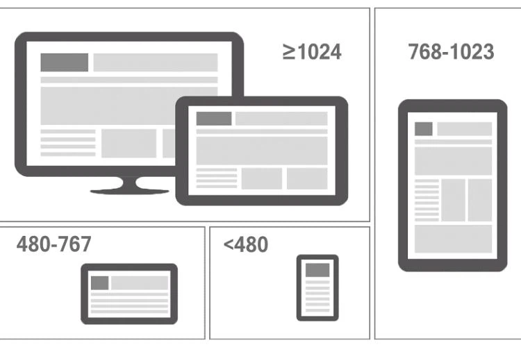
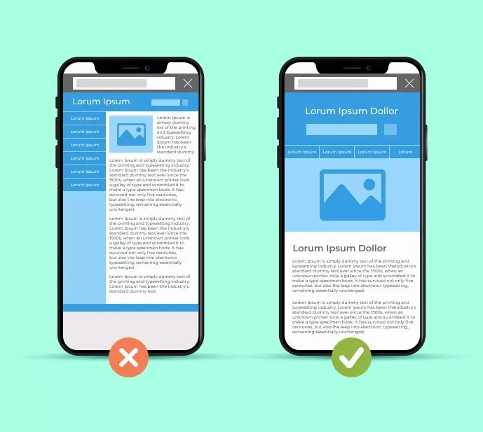
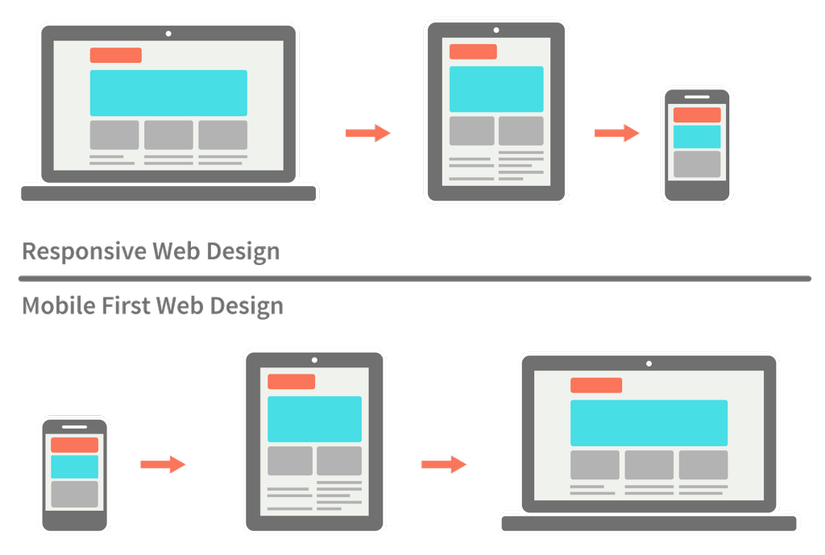

# Responsive

## 1. Responsive là gì? vì sao lại phải dùng Responsive trong lập trình web:
Responsive giúp giao diện của chúng ta hiển thị trên các thiết bị khác nhau, trên các trình duyệt khác nhau hay các màn hình khác nhau luôn luôn đẹp và không bị lỗi layout vẫn đáp ứng được về UI/UX. 



- Tăng trải nhiệm người dùng ở mobile




- __Ưu điểm__: Tăng trải nghiệm người dùng, thuận tiện trên mọi thiết bị.
Tăng khả năng tiếp cận người dùng trên thiết bị di động.
Tiết kiệm chi phí phát triển và duy trì website, không cần xây dựng nhiều phiên bản website khác nhau cho từng thiết bị.
Cải thiện chất lượng SEO website.

- __Nhược điểm__: Khó khăn trong thiết kế và phát triển, đòi hỏi người thiết kế website phải có kiến thức và kỹ năng chuyên môn cao.
Có thể ảnh hưởng đến SEO nếu không được phát triển đúng cách.

### Các kích thước độ rộng của màn thông dụng: 

### Mobile

- 240
- 320
- 480
- 768
- 1024

### Desktop

- 1280
- 1366
- 1440
- 1600 
- 1920

## 2. Desktop First và Mobile First



**"Desktop First"** là một phương pháp thiết kế và phát triển trang web hoặc ứng dụng web, trong đó nhà phát triển tập trung vào việc xây dựng trải nghiệm người dùng dành cho các thiết bị có màn hình lớn như máy tính để bàn trước tiên, sau đó tối ưu hóa cho các thiết bị di động nhỏ hơn.

Trong môi trường Desktop First, trải nghiệm trên máy tính để bàn được coi là ưu tiên hàng đầu, với độ phức tạp và tính năng đầy đủ. Sau đó, khi phát triển, nhà thiết kế cân nhắc và điều chỉnh trang web hoặc ứng dụng để phù hợp và hoạt động tốt trên các thiết bị di động, như điện thoại thông minh và máy tính bảng.

Tuy nhiên, tiếp cận Desktop First đang dần trở nên ít phổ biến hơn do sự gia tăng đáng kể của sự sử dụng di động trong truy cập internet. Người ta thường chuyển sang tiếp cận Mobile First để đảm bảo rằng trang web hoặc ứng dụng của họ cung cấp trải nghiệm tốt nhất cho người dùng di động, mà sau đó có thể được mở rộng cho máy tính để bàn.

> công thức chung: max-width = min-width – 1

Lưu ý: min-width: 1024 -> >= 1024

Lưu ý: max-width: 1024 -> <= 1024

>Nếu không áp dụng công thức để trừ thì sẽ bị lỗi là lấy cả 2 -> ra kết quả không mong muốn

``` css
/*Ipad ngang(1024 x 768)*/
@media screen and (max-width: 1023px){
  
}
/*Ipad dọc(768 x 1024)*/
@media screen and (max-width: 767px){
    
}
/*Tablet nhỏ(480 x 640)*/
@media screen and (max-width: 479px){
    
}
/*Iphone(480 x 640)*/
@media screen and (max-width: 319px){
    
}
/*Smart phone nhỏ*/
@media screen and (max-width: 239px){
    
}
```

**"Mobile First"** là một phương pháp thiết kế và phát triển trang web hoặc ứng dụng web, trong đó nhà phát triển tập trung vào việc xây dựng trải nghiệm người dùng dành cho thiết bị di động trước tiên, sau đó mở rộng lên các thiết bị có màn hình lớn hơn như máy tính bảng và máy tính để bàn.

Phương pháp này chú trọng vào việc tối ưu hóa trải nghiệm của người dùng trên thiết bị di động vì nó đang trở thành xu hướng phổ biến trong việc truy cập internet. Bằng cách tập trung vào mobile first, nhà phát triển đảm bảo rằng trang web hoặc ứng dụng của họ có thể hoạt động một cách hiệu quả và cung cấp trải nghiệm tốt nhất trên các thiết bị di động, cả trong việc tải trang nhanh chóng và trong việc tương tác với nội dung.

``` css
/*Smart phone nhỏ*/
@media screen and (min-width: 240px){
    
}
/*Iphone(480 x 640)*/
@media screen and (min-width: 320px){
    
}
/*Tablet nhỏ(480 x 640)*/
@media screen and (min-width: 480px){
    
}
/*Ipad dọc(768 x 1024)*/
@media screen and (min-width: 768px){
    
}
/*Ipad ngang(1024 x 768)*/
@media screen and (min-width: 1024px){
  
}
```

## 3. Retina, Portrait và landscape
### Retina:
Để xử lý các màn hình có độ phân giải cao như Retina, bạn có thể sử dụng các kỹ thuật như sử dụng hình ảnh có độ phân giải cao hơn và sử dụng đơn vị đo lường như "rem" hoặc "em" để đảm bảo các thành phần trên trang web tự động điều chỉnh kích thước dựa trên độ phân giải của màn hình.

``` css
/* Hình ảnh có độ phân giải cao cho màn hình Retina */
.logo {
    background-image: url('logo@2x.png');
    background-size: contain;
}

/* Sử dụng đơn vị rem cho kích thước font */
body {
    font-size: 16px; /* Kích thước cơ bản */
    font-size: 1rem; /* Tương đương với 16px */
}

```

### Portrait và landscape:

Tất cả các điện thoại thông minh và các thiết bị di động khác đều có khả năng hiển thị ở cả chế độ dọc (Portrait) và chế độ ngang (Landscape), tùy thuộc vào cách mà người dùng xoay thiết bị của họ.

Để điều chỉnh giao diện của trang web dựa trên chế độ hiển thị của thiết bị (Portrait hoặc Landscape), có thể sử dụng Media Queries trong CSS như sau:

``` css
/* Portrait */
@media (orientation: portrait) {
    /* CSS rules for portrait orientation */
    /* Ví dụ: */
    .container {
        width: 100%;
    }
}

/* Landscape */
@media (orientation: landscape) {
    /* CSS rules for landscape orientation */
    /* Ví dụ: */
    .container {
        width: 50%;
    }
}

```

Trong phần @media (orientation: portrait) {}, bạn có thể thiết lập các luật CSS sẽ được áp dụng khi thiết bị ở chế độ Portrait (dọc). Ví dụ, trong trường hợp này, .container có thể được thiết lập để chiếm toàn bộ chiều rộng của trình duyệt.

Trong phần @media (orientation: landscape) {}, bạn có thể thiết lập các luật CSS sẽ được áp dụng khi thiết bị ở chế độ Landscape (ngang). Ví dụ, trong trường hợp này, .container có thể được thiết lập để chiếm một phần nhỏ hơn của chiều rộng của trình duyệt.

## Bài tập:
Responsive page wedding: [Link-Figma](https://www.figma.com/file/OnDbsmYdIzhOf4tBFOhPxT/Services-Providing-Landing-Pages?type=design&node-id=0-1&mode=design&t=nMqKeYoyhYkw0aaJ-0)